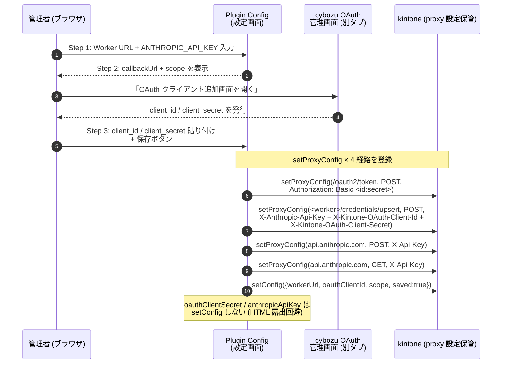
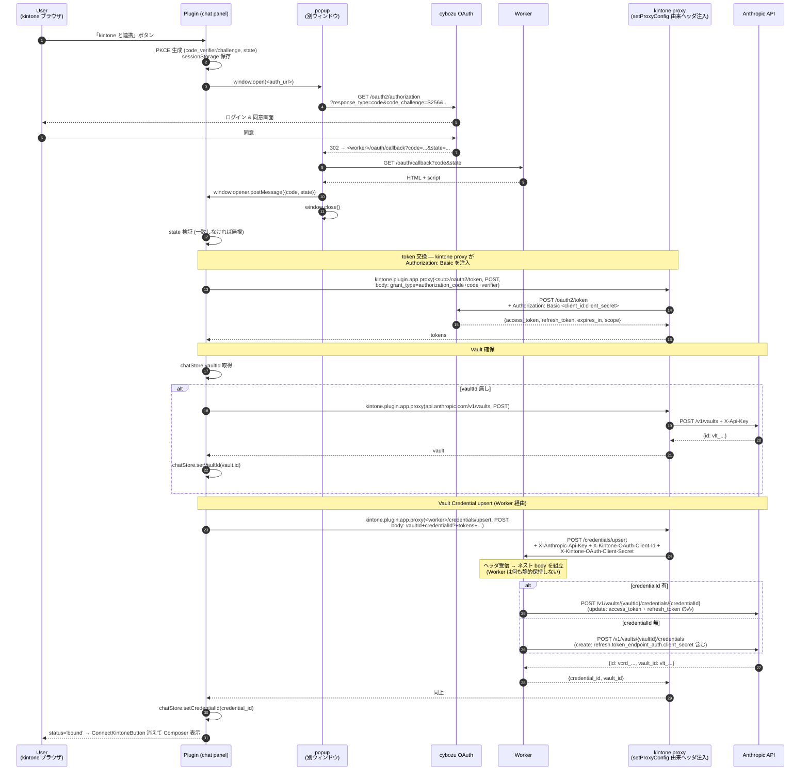
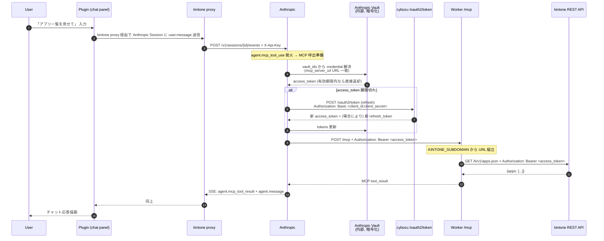
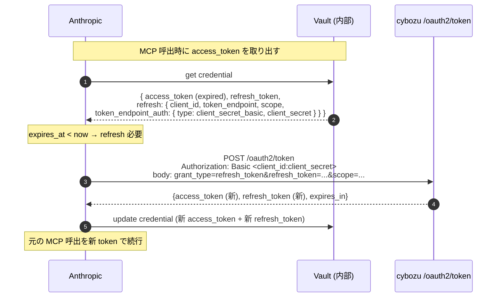

# Phase 1b-3 — OAuth pivot 設計

## シーケンス図

### S1. 管理者セットアップ (Plugin Config 保存時、1 回のみ)



### S2. End-user OAuth バインディング (初回 + 再連携、ユーザー毎)



### S3. 通常のチャット時 (kintone データ取得)



### S4. token 期限切れ時の自動 refresh (Anthropic 内蔵動作の詳細)



### 重要な不変条件 (シーケンス全体)

- **Worker が静的保持する secret はゼロ**。`KINTONE_SUBDOMAIN` (vars) のみ
- すべての secret は **kintone proxy 由来の固定ヘッダ** 経由で都度運ばれる
- **client_secret が Plugin JS / setConfig / HTML に露出することは無い** (= 一般 user の getConfig からは見えない)
- Anthropic Vault に保管された access_token / refresh_token は API レスポンスで返らないため、Plugin / Worker からも事後的に読み出せない
- 期限切れ refresh は **Anthropic 内蔵**で完結 (Plugin / Worker は介在しない)

## ファイル構成の変更

### 削除

| パス | 理由 |
|---|---|
| `packages/kintone-mcp/src/jwt.ts` | JWT 廃止 (Bearer 透過モード) ※削除済 |
| `packages/kintone-mcp/src/mint.ts` | `/mint` 廃止 ※削除済 |
| `packages/kintone-mcp/src/server/tool-filters.ts` | API token 分岐不要 ※削除済 |
| `packages/kintone-mcp/tests.disabled.phase1b3/` | 旧 JWT テスト群、新テストに置き換え後に削除 |
| `packages/plugin/src/core/mcp/mintClient.ts` | Worker `/mint` 呼出廃止 |
| `packages/plugin/src/core/mcp/mintClient.test.ts` | 同上 |
| `packages/plugin/src/desktop/components/CredentialDialog.tsx` | login/password 入力廃止 |
| `packages/plugin/src/desktop/components/CredentialDialog.test.tsx` | 同上 |

### 新規追加

| パス | 役割 |
|---|---|
| `packages/kintone-mcp/src/oauth-callback.ts` | `/oauth/callback` ハンドラ ※追加済 |
| `packages/kintone-mcp/src/credentials-upsert.ts` | `/credentials/upsert` ハンドラ (Worker secret に持つ client_secret を Anthropic body に埋めて転送) |
| `packages/kintone-mcp/tests/oauth-callback.test.ts` | callback HTML レンダリングテスト |
| `packages/kintone-mcp/tests/credentials-upsert.test.ts` | Anthropic 呼出 body の組立、X-Anthropic-Api-Key 転載、create / update 分岐 |
| `packages/kintone-mcp/tests/mcp.test.ts` | Bearer 透過モードのテスト (新仕様) |
| `packages/kintone-mcp/tests/kintone.test.ts` | Bearer ヘッダ生成テスト (新仕様) |
| `packages/plugin/src/core/oauth/pkce.ts` | code_verifier / challenge / state 生成 |
| `packages/plugin/src/core/oauth/pkce.test.ts` | |
| `packages/plugin/src/core/oauth/popup.ts` | popup 制御 + postMessage 受信 |
| `packages/plugin/src/core/oauth/popup.test.ts` | |
| `packages/plugin/src/core/oauth/tokenExchange.ts` | kintone proxy 経由で `/oauth2/token` を叩く |
| `packages/plugin/src/core/oauth/tokenExchange.test.ts` | |
| `packages/plugin/src/core/oauth/credentialsUpsertClient.ts` | kintone proxy 経由で Worker `/credentials/upsert` を叩く |
| `packages/plugin/src/core/oauth/credentialsUpsertClient.test.ts` | |
| `packages/plugin/src/desktop/components/ConnectKintoneButton.tsx` | 「kintone と連携」ボタン |
| `packages/plugin/src/desktop/components/ConnectKintoneButton.test.tsx` | |

### 既存ファイル改修

| パス | 改修内容 |
|---|---|
| `packages/kintone-mcp/src/index.ts` | `/oauth/callback` ルート追加済、`KINTONE_SUBDOMAIN` env 利用 |
| `packages/kintone-mcp/src/mcp.ts` | Bearer 透過モード化済 |
| `packages/kintone-mcp/src/kintone.ts` | KintoneCreds = { domain, bearer } に変更済 |
| `packages/kintone-mcp/wrangler.toml` | `KINTONE_SUBDOMAIN` を vars 化、JWT/MINT secret 不要 |
| `packages/plugin/src/core/managed-agents/types.ts` | VaultCredentialAuth に `mcp_oauth` バリアント追加 |
| `packages/plugin/src/core/managed-agents/resources.ts` | `createMcpOAuthCredential` 追加 |
| `packages/plugin/src/core/kintone/pluginConfig.ts` | `workerUrl` / `oauthClientId` / `scope` を追加読み出し |
| `packages/plugin/src/config/ConfigScreen.tsx` | 3 ステップウィザード化 |
| `packages/plugin/src/config/ConfigScreen.test.tsx` | 新仕様に書き直し |
| `packages/plugin/src/desktop/hooks/useUserBinding.ts` | OAuth flow ハンドラへ書き直し |
| `packages/plugin/src/desktop/hooks/useUserBinding.test.ts` | 同上 |
| `packages/plugin/src/desktop/ChatPanel.tsx` | CredentialDialog 削除、ConnectKintoneButton に差し替え |
| `packages/plugin/src/store/chatStore.ts` | `vaultId` フィールド追加 |
| `packages/plugin/src/core/bootstrap/resolveAgent.ts` | `mcp_servers` + `mcp_toolset` を含める |
| `packages/plugin/src/core/bootstrap/resolveSession.ts` | `vault_ids` を渡す |

## 主要モジュール設計

### `core/oauth/pkce.ts`

```ts
export interface PkceState {
  codeVerifier: string;  // base64url(32 bytes random)
  codeChallenge: string; // base64url(sha256(codeVerifier))
  state: string;         // base64url(16 bytes random)
}

export function generatePkce(): Promise<PkceState>;

const STORAGE_KEY = 'cowork-agent.oauth.pkce';
export function savePkce(s: PkceState): void;            // sessionStorage
export function loadPkce(): PkceState | null;
export function clearPkce(): void;
```

**実装ポイント**:
- Web Crypto API (`crypto.getRandomValues` + `crypto.subtle.digest('SHA-256')`) で
  Node 互換不要
- base64url は `btoa` + replace で実装

### `core/oauth/popup.ts`

```ts
export interface OAuthCallbackPayload {
  source: 'cowork-agent-kintone-mcp';
  code: string | null;
  state: string;
  error: string | null;
  error_description: string | null;
}

export interface OpenOAuthPopupOptions {
  authorizationUrl: string; // 完成された /authorize URL
  expectedState: string;
  expectedOrigin: string;   // Worker URL の origin
  /** タイムアウト (ms)。default 300000 (5min) */
  timeoutMs?: number;
}

export function openOAuthPopup(opts: OpenOAuthPopupOptions): Promise<OAuthCallbackPayload>;
```

**動作**:
1. `window.open(authorizationUrl, '_blank', 'popup,width=480,height=640')`
2. `window.addEventListener('message', handler)` を登録
3. 受信時に検証:
   - `event.origin === expectedOrigin`
   - `payload.source === 'cowork-agent-kintone-mcp'`
   - `payload.state === expectedState`
4. 検証通過した payload で resolve、それ以外は無視 (popup が閉じるか timeout で reject)
5. `popup.closed` を polling し、user キャンセル検知 → reject
6. cleanup (event listener 解除、popup close)

**テスト**: `window.open` モック + `window.dispatchEvent(new MessageEvent(...))`
で payload 注入。

### `core/oauth/tokenExchange.ts`

```ts
export interface TokenExchangeArgs {
  pluginId: string;
  tokenUrl: string;       // https://<sub>.cybozu.com/oauth2/token
  redirectUri: string;    // <worker>/oauth/callback
  code: string;
  codeVerifier: string;
}

export interface KintoneTokens {
  access_token: string;
  refresh_token?: string;
  token_type: 'bearer';
  expires_in: number;
  scope: string;
}

export async function exchangeCodeForTokens(args: TokenExchangeArgs): Promise<KintoneTokens>;
```

**動作**:
- `kintone.plugin.app.proxy(pluginId, tokenUrl, 'POST', {}, body, success, fail)`
  を Promise 化
- body は `application/x-www-form-urlencoded`:
  `grant_type=authorization_code&code=<>&redirect_uri=<>&code_verifier=<>`
- `Authorization: Basic <client_id:client_secret>` は setProxyConfig 由来 (この
  関数からは触らない)
- 成功時にトークンを返す。`access_token` 欠損なら例外

**テスト**: `kintone.plugin.app.proxy` をモック。

### `core/oauth/credentialsUpsertClient.ts` (新規)

Plugin から **Worker `/credentials/upsert` を kintone proxy 経由で呼ぶクライアント**。
Anthropic API を Plugin が直接叩く代わりにこの経路を使うことで、ネスト body
への client_secret 埋込みを Worker に委譲する。Worker は何の secret も持たず、
**kintone proxy 由来の固定ヘッダ経由で都度 client_secret を受け取る**。

```ts
export interface UpsertKintoneCredentialArgs {
  pluginId: string;
  workerUrl: string;
  vaultId: string;
  credentialId?: string;          // 与えれば update、無ければ create
  mcpServerUrl: string;
  accessToken: string;
  expiresIn: number;               // /oauth2/token から取得
  refreshToken?: string;
  scope?: string;
  // client_id / client_secret は kintone proxy ヘッダ経由で渡るため、ここに含めない
}

export interface UpsertResult {
  credential_id: string;
  vault_id: string;
}

export async function upsertKintoneCredential(
  args: UpsertKintoneCredentialArgs,
): Promise<UpsertResult>;
```

**動作**:
- `kintone.plugin.app.proxy(pluginId, '<workerUrl>/credentials/upsert', 'POST', {}, body)`
- body には access_token / refresh_token / vaultId / mcpServerUrl / scope 等の
  **非秘匿情報のみ**。client_id / client_secret / Anthropic API key は body に
  含めず、すべて kintone proxy が固定ヘッダで注入する
- Worker のレスポンスは `{ credential_id, vault_id }` を返す形式 (Anthropic
  のレスポンス全体ではなく必要最小限のみ転載)

### `kintone-mcp/src/credentials-upsert.ts` (新規, Worker 側)

```ts
export async function handleCredentialsUpsert(request: Request, env: Env): Promise<Response>;
```

#### Env (拡張なし)

```ts
export interface Env {
  KINTONE_SUBDOMAIN: string;
  // ※ client_id / client_secret は env に持たない (リクエストヘッダで受け取る)
}
```

Worker は **何の secret も保持しない**。OAuth クライアント情報はリクエスト毎に
kintone proxy 由来のヘッダで受け取る。

#### リクエスト contract

入力 (Plugin から、kintone proxy 経由):

```
POST https://<worker>/credentials/upsert
X-Anthropic-Api-Key: <ANTHROPIC_API_KEY>             ← 必須
X-Kintone-OAuth-Client-Id: <client_id>               ← Create 時必須、Update 時任意
X-Kintone-OAuth-Client-Secret: <client_secret>       ← Create 時必須、Update 時任意
Content-Type: application/json

{
  "vaultId": "vlt_...",
  "credentialId": "vcrd_...",          // optional, 有れば update
  "mcpServerUrl": "https://<worker>/mcp",
  "accessToken": "<kintone access_token>",
  "expiresIn": 3600,
  "refreshToken": "<kintone refresh_token>",   // optional
  "scope": "k:app_record:read ..."
}
```

> `tokenEndpoint` は Worker の `KINTONE_SUBDOMAIN` から導出 (`https://${KINTONE_SUBDOMAIN}/oauth2/token`)。
> Plugin から body で送る必要なし。

出力 (Plugin へ):

```json
{ "credential_id": "vcrd_...", "vault_id": "vlt_..." }
```

#### Worker 内処理フロー

```
1. ヘッダ X-Anthropic-Api-Key を取り出し、無ければ 401
2. body を JSON parse、必須フィールドを検証
3. credentialId が有れば update path、無ければ create path

create path:
  ヘッダ X-Kintone-OAuth-Client-Id / X-Kintone-OAuth-Client-Secret を必須要求
  (refreshToken が指定されている場合)、無ければ 400

  POST https://api.anthropic.com/v1/vaults/{vaultId}/credentials
  body: {
    auth: {
      type: 'mcp_oauth',
      mcp_server_url: <body.mcpServerUrl>,
      access_token: <body.accessToken>,
      expires_at: now + body.expiresIn,
      refresh: body.refreshToken ? {
        refresh_token: <body.refreshToken>,
        token_endpoint: `https://${env.KINTONE_SUBDOMAIN}/oauth2/token`,
        client_id: <header X-Kintone-OAuth-Client-Id>,
        scope: <body.scope>,
        token_endpoint_auth: {
          type: 'client_secret_basic',
          client_secret: <header X-Kintone-OAuth-Client-Secret>,   // ← ヘッダから
        },
      } : undefined,
    },
    display_name: 'kintone',
  }

update path:
  POST https://api.anthropic.com/v1/vaults/{vaultId}/credentials/{credentialId}
  body: {
    auth: {
      type: 'mcp_oauth',
      access_token: <body.accessToken>,
      expires_at: now + body.expiresIn,
      refresh: body.refreshToken ? {
        refresh_token: <body.refreshToken>,
        scope: <body.scope>,
        // client_secret は省略 (Anthropic が既存値を保持)
      } : undefined,
    },
  }

4. Anthropic レスポンスを最小化して返す
   - 成功: 200 + { credential_id, vault_id }
   - 失敗: Anthropic ステータスをそのまま転載 + body も転載 (デバッグ用)
```

#### セキュリティ要件

- X-Anthropic-Api-Key ヘッダが無い・空のリクエストは 401 で拒否
- Worker は受信した全 secret 系ヘッダ (`X-Anthropic-Api-Key` /
  `X-Kintone-OAuth-Client-Id` / `X-Kintone-OAuth-Client-Secret`) を
  **メモリ上で 1 回使うのみ**。ログには絶対出力しない
- body の access_token / refresh_token も同様にログ出力しない
  (mask して受信メソッド名のみログ)

### `core/managed-agents/resources.ts` (削減)

`createMcpOAuthCredential` は **追加しない**。代わりに Plugin の連携フローでは
`upsertKintoneCredential` (Worker 経由) を使う。

ただし **Vault 作成 (POST /v1/vaults)** と **Credential 取得 (GET /v1/vaults/{id}/credentials/{id})** は
Anthropic の通常 API ですむため、Plugin から直接叩く既存の `client.ts`
パターンで OK。

```ts
// resources.ts には Vault CRUD のみ残す
export async function createVault(client, args): Promise<Vault>;
export async function getCredential(client, vaultId, credentialId): Promise<VaultCredential>;
export async function archiveCredential(client, vaultId, credentialId): Promise<VaultCredential>;
```

### `desktop/hooks/useUserBinding.ts` (リライト)

```ts
type BindingStatus = 'unknown' | 'unbound' | 'binding' | 'bound' | 'error';

export interface UseUserBinding {
  status: BindingStatus;
  error: string | null;
  /** OAuth フローを起動して Vault Credential を作成する */
  connect: () => Promise<void>;
  /** 既存の Vault Credential が有効か検査して bound 状態を確定させる */
  refresh: () => Promise<void>;
}
```

**connect の処理フロー**:

```
1. 設定読み出し (workerUrl, oauthClientId, scope)
   - 不足あれば status='error', error=「設定が未完成」
2. PKCE state 生成 + sessionStorage 保存
3. 認可 URL 構築
4. openOAuthPopup → payload 取得 (失敗時 status='error')
5. exchangeCodeForTokens → tokens 取得 (失敗時 同上)
6. ensureUserVault:
   - chatStore.vaultId があれば既存 Vault を再利用
   - 無ければ POST /v1/vaults (display_name = `<kintone_user_code> credentials`)
   - 作成した vaultId を chatStore に保存
7. upsertKintoneCredential (詳細は下記)
8. chatStore.setCredentialId
9. status='bound'
```

**upsertKintoneCredential の処理フロー**:

Plugin は **Worker `/credentials/upsert` を呼ぶだけ**。Worker 側がパス分岐を含む
全責務を持つ:

```
入力: vaultId, credentialId? (chatStore から), mcpServerUrl, tokens, oauthClientId,
      tokenEndpoint, scope

Plugin (useUserBinding):
  upsertKintoneCredential({
    pluginId, workerUrl, vaultId, credentialId,
    mcpServerUrl, accessToken, expiresIn, refreshToken,
    oauthClientId, tokenEndpoint, scope,
  });

Worker (handleCredentialsUpsert):
  1. credentialId が指定されている場合 → Update path (PATCH 相当)
     - access_token / expires_at / refresh.refresh_token のみ更新
     - client_secret は body に含めない (Anthropic が既存値を保持)
  2. credentialId が無い場合 → Create path
     - 全フィールド + client_secret (Worker secret から取得) を埋めて create

Plugin はレスポンスから { credential_id } を取り出して chatStore.setCredentialId。
```

**Worker は Anthropic にエラーが返った場合 (例: 古い credentialId が archive
されていた)** も、本フェーズでは Plugin に Anthropic の status / body を
そのまま返す。Plugin は 4xx を受けたら、credential を一度クリアして次の
connect でフル create を実行する fallback を持つ。

```
Plugin fallback:
  - 1 回目の upsert (with credentialId) が 404 を返したら、credentialId を
    chatStore からクリアし、もう 1 回 upsert (without credentialId) で create
  - その他のエラーは status='error' でユーザーに表示
```

**注意**: 「OAuth クライアントを差し替えた等で immutable フィールド (client_id /
token_endpoint / mcp_server_url) が変わった」ケースは本フェーズでは Plugin
fallback の範囲外とする。管理者が ConfigScreen 再保存 → ユーザーが「再連携」
を押す動線は Phase 1c で整える。

**refresh の処理フロー**:

```
1. chatStore.credentialId が無ければ status='unbound'
2. GET /v1/vaults/{vaultId}/credentials/{credentialId}
   - 200 + archived_at=null → status='bound'
   - それ以外 → status='unbound'
```

### `desktop/components/ConnectKintoneButton.tsx`

```tsx
interface Props {
  status: BindingStatus;
  onConnect: () => void;
  error?: string | null;
}
```

- `status === 'unbound'`: ボタン表示「kintone と連携」
- `status === 'binding'`: スピナー + 文言「認可中…」
- `status === 'error'`: エラーメッセージ + 再試行ボタン
- `status === 'bound'`: ボタン非表示 (チャット入力欄が出る)

### `config/ConfigScreen.tsx` (3 ステップウィザード)

internal state:
```ts
{
  workerUrl: string;
  anthropicApiKey: string;
  clientId: string;
  clientSecret: string;
  scope: string;
  showSecret: boolean;
  showApiKey: boolean;
  saving: boolean;
  saved: boolean;
}
```

副計算:
- `callbackUrl = new URL('/oauth/callback', workerUrl).toString()` (空なら null)
- `cybozuOAuthAdminUrl = `https://${location.hostname}/admin/integrations/oauth/list``

ステップ:
1. Worker URL + ANTHROPIC_API_KEY 入力欄
2. (workerUrl 入力済なら) callbackUrl 表示 + コピー / scope 表示 + コピー /
   admin 画面リンク (`<a target="_blank" rel="noopener noreferrer">`)
3. (workerUrl 入力済なら) clientId / clientSecret / scope 入力 + 保存

保存処理 (擬似コード):
```ts
async function save() {
  const cfg = {
    workerUrl,
    oauthClientId: clientId,
    scope,
    saved: 'true',
    // anthropicApiKey / oauthClientSecret は setConfig しない
  };

  // 1) /oauth2/token 用 (token 交換 + Anthropic 自動 refresh)
  await setProxyConfig(
    new URL('/oauth2/token', location.origin).toString(),
    'POST',
    {
      Authorization: `Basic ${btoa(`${clientId}:${clientSecret}`)}`,
      'Content-Type': 'application/x-www-form-urlencoded',
    },
    {},
  );

  // 2) Worker /credentials/upsert 用 (Anthropic API key + OAuth client 情報を固定ヘッダで)
  //    Worker は何も保持せず、ここで注入されるヘッダだけが secret を運ぶ
  await setProxyConfig(
    `${workerUrl}/credentials/upsert`,
    'POST',
    {
      'X-Anthropic-Api-Key': anthropicApiKey,
      'X-Kintone-OAuth-Client-Id': clientId,
      'X-Kintone-OAuth-Client-Secret': clientSecret,
      'Content-Type': 'application/json',
    },
    {},
  );

  // 3) Anthropic 通常 API 用 (vault create / agent / session など)
  //    プレフィクス指定で /v1/* 全体に X-Api-Key を付与
  await setProxyConfig(
    'https://api.anthropic.com/',
    'POST',
    {
      'X-Api-Key': anthropicApiKey,
      'anthropic-version': '2023-06-01',
      'anthropic-beta': 'managed-agents-2026-04-01',
      'Content-Type': 'application/json',
    },
    {},
  );
  await setProxyConfig(
    'https://api.anthropic.com/',
    'GET',
    {
      'X-Api-Key': anthropicApiKey,
      'anthropic-version': '2023-06-01',
      'anthropic-beta': 'managed-agents-2026-04-01',
    },
    {},
  );

  kintone.plugin.app.setConfig(cfg, () => location.href = '../../flow?app=' + appId);
}
```

**Worker secret の手動設定は不要**。client_secret はすべて setProxyConfig の
固定ヘッダ経由で運ばれるため、admin が Cloudflare 側で行う作業は
`wrangler deploy` (または Deploy ボタン経由のデプロイ) のみ。

### `core/kintone/pluginConfig.ts` (拡張)

```ts
export interface PluginConfig {
  workerUrl: string | null;
  oauthClientId: string | null;
  scope: string | null;
  saved: boolean;
}

export function readPluginConfig(pluginId: string): PluginConfig;
```

`oauthClientSecret` は **読み出さない** (二度と JS から触らない)。

### `core/managed-agents/types.ts` (拡張)

```ts
export interface VaultCredentialAuthMcpOAuth {
  type: 'mcp_oauth';
  mcp_server_url: string;
  expires_at?: string;
  refresh?: {
    client_id: string;
    token_endpoint: string;
    scope?: string;
    token_endpoint_auth:
      | { type: 'none' }
      | { type: 'client_secret_basic' }
      | { type: 'client_secret_post' };
  };
}

export type VaultCredentialAuth =
  | VaultCredentialAuthStaticBearer
  | VaultCredentialAuthMcpOAuth;
```

### `store/chatStore.ts`

新規フィールド:
```ts
vaultId: string | null;
setVaultId(id: string | null): void;
```

既存 `credentialId` はそのまま。

### Vault のライフサイクル方針 — **ユーザー毎 1 Vault**

将来の他 MCP サーバー (Slack / GitHub / その他外部 SaaS) との連携も見据え、
**1 kintone ユーザー = 1 Vault** を所有する設計にする。Vault 内には MCP サーバー
ごとの Credential が並ぶ:

```
Vault: vlt_<userA>
  ├─ Credential: kintone (mcp_oauth, mcp_server_url=worker/mcp)
  ├─ Credential: slack    (将来)
  └─ Credential: github   (将来)

Vault: vlt_<userB>
  └─ Credential: kintone
```

- chatStore の persist キーは **kintone ユーザー code でネームスペース** する
  (`cowork-agent.<user_code>`)。同一ブラウザで A/B 両ユーザーが kintone に
  ログインしても vault が混在しない
- 既に `vaultId` を持つユーザーが「kintone と連携」を押した場合、新規 Vault は
  作らず **既存 Vault に Credential を追加** する
- 既に `credentialId` (kintone) も持っているユーザーの場合は、archive 後に新規
  Credential を発行 (refresh_token が古くて使えない可能性があるため)
- Vault や Credential の archive は今フェーズではユーザー操作で発生せず、
  「再連携」時に内部で実行

### `core/bootstrap/resolveAgent.ts`

mcp_servers + mcp_toolset を必ず含める:

```ts
{
  model: 'claude-sonnet-4-6',
  name: AGENT_NAME,
  system: SYSTEM_PROMPT,
  mcp_servers: [{ type: 'url', name: 'kintone', url: `${workerUrl}/mcp` }],
  tools: [{
    type: 'mcp_toolset',
    mcp_server_name: 'kintone',
    default_config: { enabled: true, permission_policy: { type: 'always_allow' } },
  }],
}
```

### `core/bootstrap/resolveSession.ts`

```ts
const vaultIds = vaultId ? [vaultId] : [];
return await client.post('/v1/sessions', {
  agent: agentId,
  environment_id: environmentId,
  vault_ids: vaultIds,
});
```

## エラーハンドリング戦略

| 失敗ポイント | UX |
|---|---|
| Worker URL 未設定 | 連携ボタンを「先に管理者が設定してください」案内に切替 |
| popup ブロック | ブラウザの popup 許可案内 + 再試行 |
| user OAuth キャンセル | エラー表示せず unbound に戻る |
| token 交換 4xx | エラー文言 + 再試行ボタン (再度 OAuth から) |
| Vault 作成失敗 (Anthropic API) | API エラー詳細表示 + 再試行 |
| 既存 Credential が archive されていた | refresh で `unbound` に切り替え、再連携ボタンを表示 |
| 期限切れ → Anthropic refresh 失敗 | MCP tool 呼び出し時に 401 が来るので、tool error 時に
  Plugin に通知して再連携 UX に誘導 (今フェーズではログのみで OK) |

## セキュリティ考慮

### 秘密情報の格納場所

| 値 | どこに保管するか | Plugin JS から読める? | Worker に保管? |
|---|---|---|---|
| `kintone OAuth client_id` | (a) setConfig (authorize URL 構築用、公開可能) <br>(b) setProxyConfig 固定ヘッダ X-Kintone-OAuth-Client-Id (Worker `/credentials/upsert` 用) | (a) ○ (b) × | × |
| `kintone OAuth client_secret` | setProxyConfig 固定ヘッダ × 2:<br>・/oauth2/token の Basic auth<br>・Worker /credentials/upsert の X-Kintone-OAuth-Client-Secret | × | × |
| `ANTHROPIC_API_KEY` | setProxyConfig 固定ヘッダ × 複数:<br>・api.anthropic.com の X-Api-Key<br>・Worker /credentials/upsert の X-Anthropic-Api-Key | × | × |
| `Anthropic Vault に保管された tokens` | Anthropic Vault (暗号化、API レスポンスでも返らない) | × | × |
| `kintone OAuth access/refresh tokens` (転送中) | Plugin → kintone proxy → Worker → Anthropic の HTTPS 通信路 | (転送中のみ) | (転送中のみ) |

**Worker は何の secret も静的に保持しない**。リクエスト毎に kintone proxy 由来の
ヘッダで都度受け取り、Anthropic body に詰めて転送するだけ。

### 検証ポイント

- **state 検証**: sessionStorage の値と postMessage payload の `state` 一致を必須に
- **postMessage origin 検証**: Worker URL の origin と event.origin 一致を必須に
- **Worker は X-Anthropic-Api-Key を必須要求**: 無いリクエストは 401 (認証されていない
  Plugin が Worker を悪用して Anthropic Vault Credential を作るのを防止)
- **Worker は ログに secret を絶対出力しない**: access_token / refresh_token /
  X-Anthropic-Api-Key / X-Kintone-OAuth-Client-Secret いずれもマスクして処理

### Worker setup 手順 (admin)

```bash
wrangler deploy   # secret put は不要
```

vars (`KINTONE_SUBDOMAIN`) のみ `wrangler.toml` で指定する。secret 系の手動設定
作業はゼロ。

## テスト戦略

### Worker

| テスト | 内容 |
|---|---|
| `mcp.test.ts` | Bearer 無し → 401、Bearer 有り → kintone fetch を呼ぶ (mock) |
| `kintone.test.ts` | `Authorization: Bearer` ヘッダの組立て検証 |
| `oauth-callback.test.ts` | code/state クエリ → HTML 内に値が埋め込まれる、postMessage 用 script に payload が含まれる |
| `credentials-upsert.test.ts` | X-Anthropic-Api-Key 無し → 401、X-Kintone-OAuth-Client-Secret 無しで refreshToken 有 → 400、有り + body 完備 → Anthropic POST 1 回呼ばれる (body のネスト構造検証)、credentialId 有 → update path、無 → create path |
| `tools/*.test.ts` | 既存の各ツール、引数検証と URL 組立て (creds.bearer のモックで OK) |

### Plugin

| テスト | 内容 |
|---|---|
| `oauth/pkce.test.ts` | base64url 形式、SHA-256 一致、state は十分なエントロピー |
| `oauth/popup.test.ts` | window.open モック、postMessage で resolve、不正 origin 無視、timeout で reject |
| `oauth/tokenExchange.test.ts` | kintone.plugin.app.proxy mock、body 形式、エラー時例外 |
| `oauth/credentialsUpsertClient.test.ts` | kintone.plugin.app.proxy mock で Worker /credentials/upsert を叩く形式、create / update 切替、4xx 時 fallback (credentialId クリア) |
| `bootstrap/resolveAgent.test.ts` | mcp_servers + mcp_toolset を含む |
| `bootstrap/resolveSession.test.ts` | vault_ids を渡す |
| `desktop/hooks/useUserBinding.test.ts` | connect 成功フロー、popup キャンセル、token 交換失敗 |
| `desktop/components/ConnectKintoneButton.test.tsx` | 各 status 別表示 |
| `config/ConfigScreen.test.tsx` | 3 ステップ表示制御、callbackUrl 計算、保存時 setProxyConfig 呼出 |

### E2E

- 既存 `e2e/setup.spec.ts` (旧 JWT バインディング想定) は **OAuth flow E2E に
  書き直す**。手動依存を最小化するため Playwright で popup を制御する。
- 認証情報は `.env` の `KINTONE_USERNAME` / `KINTONE_PASSWORD` を流用 (既に
  E2E 環境で利用中の管理者アカウント)。
- cybozu OAuth 同意画面は同一クライアント + 同一ユーザーで 2 回目以降スキップ
  される設計のため、初回テスト実行時のみ「許可」クリック処理を含める。

#### `e2e/oauth-binding.spec.ts` のフロー

```ts
test('OAuth バインディングが完走し、Vault Credential が発行される', async ({ page, context }) => {
  // 1. kintone にログイン (既存 e2e/global-setup.ts と同じ仕組み)
  // 2. Plugin が動くアプリ画面を開き、ChatPanel を開く
  // 3. ConnectKintoneButton をクリック
  // 4. 新しい popup を待ち受け
  const [popup] = await Promise.all([
    context.waitForEvent('page'),
    page.click('[data-testid="connect-kintone"]'),
  ]);

  // 5. popup 内: cybozu OAuth 同意画面 (初回のみ表示) → 「許可」クリック
  //    既に同意済みの場合は cybozu が自動で /oauth/callback にリダイレクト
  if (await popup.locator('button:has-text("許可")').isVisible({ timeout: 5000 })) {
    await popup.click('button:has-text("許可")');
  }

  // 6. popup が Worker /oauth/callback に遷移 → postMessage 後に閉じる
  //    Plugin (page) 側で status='bound' になるのを待つ
  await page.waitForSelector('[data-testid="composer"]', { timeout: 30_000 });

  // 7. chatStore.vaultId / credentialId が localStorage に保存されていることを検証
  const stored = await page.evaluate(() => localStorage.getItem('cowork-agent.<user>'));
  expect(stored).toMatch(/vlt_/);
  expect(stored).toMatch(/vcrd_/);
});
```

- popup ハンドリングは Playwright の `context.waitForEvent('page')` で標準対応
- 「許可」ボタン文言が cybozu UI 変更で割れる可能性があるが、E2E は通常 1 回
  通過すれば 2 回目以降同意 skip されるので影響は限定的
- テスト後 cleanup: 作成した Vault / Credential を archive (afterEach で API 呼出)
  - 既存 `e2e/global-teardown.ts` に追加実装

#### OAuth に依存しない既存 E2E

- チャット起動 / セッション履歴復元 / 配置確認系: `oauth-binding.spec.ts` を
  beforeAll で 1 度だけ通して bound 状態にしてから、共通フィクスチャとして使う
- これで他 spec は OAuth UI を毎回操作せずに済む

## マイグレーション手順 (既存環境への影響)

開発環境のみ。本番ユーザーは未だいないため互換性配慮なし。

1. 既存 chatStore に `userEnvironmentId` / 古い credentialId があれば破棄
2. Plugin 設定画面で 3 ステップを再入力
3. 「kintone と連携」ボタンで初回 OAuth flow
4. 旧 ConfigScreen の MINT_API_KEY 入力欄は削除済 → 自動的に新 UI 表示

## 完了条件 (再掲・チェック付き)

- [ ] Worker `/mcp` Bearer 透過 + tests green
- [ ] Worker `/oauth/callback` HTML 提供 + tests green
- [ ] Plugin Config 3 ステップウィザード動作 + setProxyConfig 設定確認
- [ ] Plugin OAuth popup → token 交換 → Vault Credential 作成まで動作
- [ ] チャット送信 → Worker `/mcp` 呼出 → kintone 実データ取得が動く
- [ ] アプリリロード後も bound 状態を保持し再認可不要
- [ ] 既存 unit tests / typecheck / e2e (OAuth 非依存範囲) green
