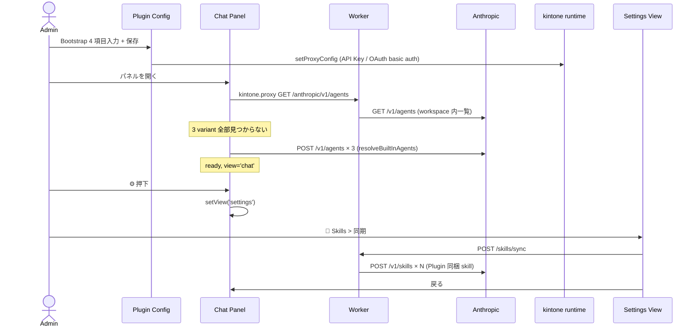
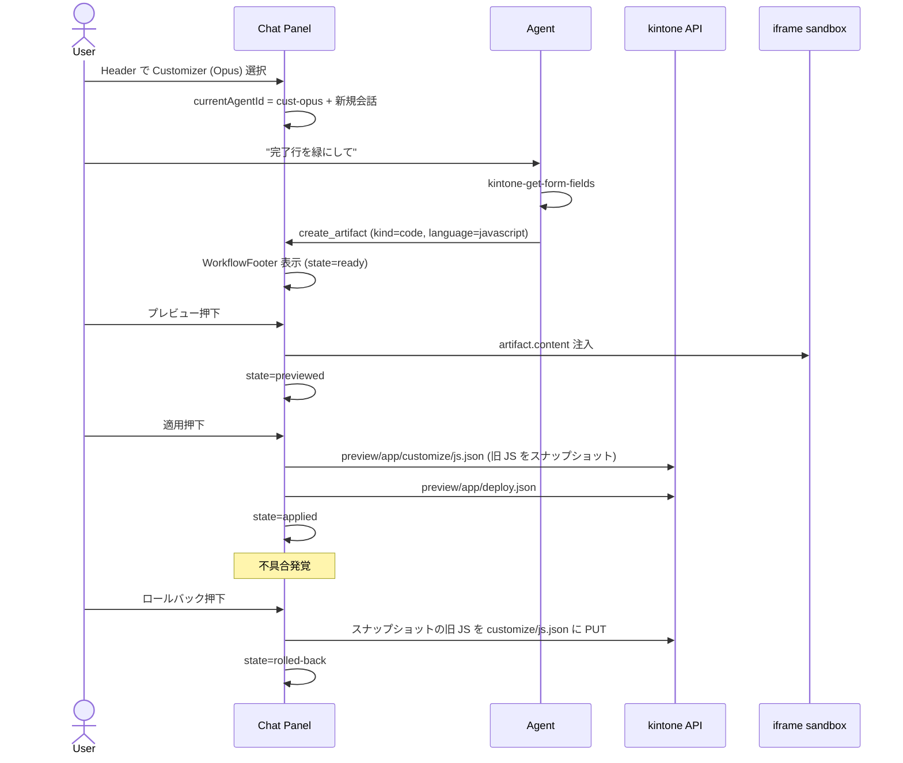

# Customizer Wedge — 実装設計 (design.md)

> **位置づけ**: [requirements.md](./requirements.md) で合意した V1 wedge MVP を、現在のコードベース ([packages/plugin/src/](../../packages/plugin/src/) / [packages/kintone-mcp/src/](../../packages/kintone-mcp/src/)) にどう落とすかの実装設計。UI 仕様は requirements.md Section 15 + [docs/design-handoff/customizer-wedge/](../../docs/design-handoff/customizer-wedge/) を一次ソースとする。
>
> **対象 V1 Issue**: #39 (Built-in Agent 3 variant) / #40 (Settings View インフラ) / #41 (Plugin Config Skills 削除) / #20 (preview/apply/rollback)
>
> **設計判断の指針**:
> - 既存のステートレス原則 (chatStore は localStorage に保存しない / Anthropic metadata で再解決) を維持
> - resolveDefaultAgent の in-flight Promise + metadata filter パターンを 3 variant に拡張
> - Settings View は **新 view** として ChatPanel に追加 (`view: 'chat' | 'history' | 'settings'`)
> - Plugin Config は **Bootstrap 専用に縮小**、Skills 同期は Chat Panel に完全移行 (#41)

---

## 1. 全体アーキテクチャ — 変更箇所マップ

```
┌─────────────────────────────────────────────────────────────────────┐
│ kintone (host)                                                       │
│                                                                      │
│  ┌─ Plugin Config 画面 (admin 専用) ──────────────────────────────┐ │
│  │ ConfigScreen.tsx                                              │ │
│  │  📦 縮小: Bootstrap 4項目 + (V2)追加 MCP Server 登録のみ      │ │
│  │  ❌ 削除 (#41): Skills 同期セクション                          │ │
│  └────────────────────────────────────────────────────────────────┘ │
│                                                                      │
│  ┌─ Plugin Panel (Chat side panel) ──────────────────────────────┐ │
│  │ App.tsx (パネル開閉のみ、変更なし)                            │ │
│  │  └─ ChatPanel.tsx (View 切替を拡張)                            │ │
│  │      ├─ Header (新 Header 2段構成 — design 案 C)               │ │
│  │      ├─ <ChatView>   (既存)                                   │ │
│  │      ├─ <HistoryView> (既存)                                  │ │
│  │      └─ <SettingsView> ⭐ 新規 — admin 専用                   │ │
│  │                                                                │ │
│  │  store/chatStore.ts                                            │ │
│  │   ├─ currentAgentId: string                  ⭐ 追加          │ │
│  │   ├─ view: 'chat' | 'history' | 'settings'  ⭐ settings 追加 │ │
│  │   └─ memoryEnabled: boolean                  ⭐ V2 用 placeholder│
│  │                                                                │ │
│  │  core/bootstrap/resolveAgent.ts                                │ │
│  │   └─ resolveDefaultAgent → resolveBuiltInAgents  ⭐ 3 variant │ │
│  └────────────────────────────────────────────────────────────────┘ │
└─────────────────────────────────────────────────────────────────────┘
                                  │
                                  ▼
┌─────────────────────────────────────────────────────────────────────┐
│ Cloudflare Workers (packages/kintone-mcp)                           │
│  変更なし。既存の /skills/sync / /mcp/<domain> / /anthropic/* を継続 │
└─────────────────────────────────────────────────────────────────────┘
```

**新規ファイル** (見込み):

```
packages/plugin/src/
├── core/bootstrap/
│   ├── resolveAgent.ts                     ✏ 拡張
│   ├── agentTypes.ts                       ⭐ AgentRecord / AgentGlyph / AgentColor 型
│   ├── builtInAgents.ts                    ⭐ Agent カタログ (3 variant + system prompt 分離)
│   └── builtInAgents.test.ts               ⭐
├── core/admin/
│   └── useIsAdmin.ts                       ⭐ kintone.getLoginUser().administrator 判定 hook
├── desktop/
│   ├── ChatPanel.tsx                       ✏ Header 2段化 + view='settings' 分岐
│   ├── Header.tsx                          ⭐ design 案 C 実装 (Agent pill + Memory + Gear)
│   ├── components/AgentIcon.tsx            ⭐ iconKind × iconColor × size の SVG glyph
│   ├── components/AgentPicker.tsx          ⭐ Header 下段プルダウン
│   ├── components/ModelBadge.tsx           ⭐ OPUS/SONNET バッジ
│   └── settings/
│       ├── SettingsView.tsx                ⭐ 2-pane shell
│       ├── SettingsNav.tsx                 ⭐ 192px nav
│       ├── AgentsListPane.tsx              ⭐ V1: 公開トグル + 一覧 (AgentIcon 表示)
│       ├── SkillsPane.tsx                  ⭐ V1: 同期 + 一覧 + カスタム追加
│       ├── SkillAddModal.tsx               ⭐ V1: ファイル / 直接入力タブ
│       └── (V2/V3 用 stub: AgentDetailPane / IconPicker / CustomAgentCreatePane)
└── chat/workflow/                          (#20 — wedge workflow)
    ├── WorkflowFooter.tsx                  ⭐ 5 状態 step bar
    ├── FileTree.tsx                        ⭐ customize/ ツリー
    └── useApplyWorkflow.ts                 ⭐ state machine
```

**削除ファイル** (#41): `ConfigScreen.tsx` 内の Skills 同期セクション関連ロジック (skill bundle 取得 / ボタンハンドラ等)。`skillsSyncClient.ts` 自体は Chat Panel から呼ばれる形で残す。

---

## 2. データ構造の変更

### 2.1 Plugin Config 保存形式

> **現状の Plugin Config**: `kintone.plugin.app.getConfig(pluginId)` で文字列 key-value を取得する形式。**Agent metadata は Plugin Config に保存しない** — Anthropic Workspace 側に Agent.metadata として保存し、必要なら Plugin が再 list する。

**V1 で追加する Plugin Config キー**: 無し。Agent visibility / isDefault は Anthropic Agent.metadata に持たせる (`metadata.visibility = 'public' | 'private'`, `metadata.isDefault = '1' | '0'`)。

> 理由: Plugin Config キーを増やすと kintone admin 画面の保存 / 適用フローを通る必要があり、Chat Panel から直接編集できない。Agent.metadata は Anthropic `POST /v1/agents/{id}` で新 version を作るだけで更新できる。

**V2 で増える Plugin Config キー** (V2-新規 (MCP 登録) 用、本 V1 では未対応):
- `mcpServers`: 追加 MCP Server の name / remote_url / oauth_authz_url / oauth_token_url / client_id (secret は setProxyConfig 経由)

### 2.2 PluginAgentMetadata の確定スキーマ

Anthropic `POST /v1/agents` の body に含める `metadata` 構造。requirements.md Section 6.2 を実装に落とす:

```ts
// packages/plugin/src/core/constants.ts (拡張)
export const AGENT_TYPE = {
  default: 'default',     // 既存互換
  custom: 'custom',
  // V1 では下記 purpose で判定するため type は default のままで OK
} as const;

export const AGENT_PURPOSE = {
  business: 'business',           // 業務エージェント (Sonnet)
  customizerOpus: 'customizer-opus',
  customizerSonnet: 'customizer-sonnet',
  custom: 'custom',
} as const;

export const METADATA_KEYS = {
  // 既存
  source: 'source',
  type: 'type',
  kintoneDomain: 'kintoneDomain',
  kintoneUserCode: 'kintoneUserCode',
  agentId: 'agentId',
  helperVersion: 'helperVersion',
  purpose: 'purpose',
  // 追加
  promptVersion: 'promptVersion',
  skillsVersion: 'skillsVersion',
  visibility: 'visibility',
  isDefault: 'isDefault',
  variantGroup: 'variantGroup',  // (B) 案拡張用、V1 でも入れておく
  workerUrl: 'workerUrl',
} as const;
```

**Agent.metadata の実例** (3 variant それぞれ):

```ts
// 業務エージェント
{
  source: 'cowork-agent-for-kintone',
  type: 'default',
  purpose: 'business',
  promptVersion: 'v20',
  skillsVersion: 'sha256:abc',
  visibility: 'public',
  isDefault: '0',
  workerUrl: 'https://...',
  kintoneDomain: 'tenant.cybozu.com',
  iconKind: 'biz',       // 'biz' = チェックリスト / 'cust' = ブレース
  iconColor: 'accentSoft', // Built-in は色トークン名で固定、Custom は hex
}

// カスタマイザーエージェント (Opus)
{
  ...同上,
  purpose: 'customizer-opus',
  variantGroup: 'customizer',
  iconKind: 'cust',
  iconColor: 'accent',
  isDefault: '1',  // V1 既定
}

// カスタマイザーエージェント (Sonnet)
{
  ...同上,
  purpose: 'customizer-sonnet',
  variantGroup: 'customizer',
  iconKind: 'cust',
  iconColor: 'accent',
  isDefault: '0',
}
```

#### なぜ kintoneDomain を Agent.metadata に持つか

Agent は **Anthropic Workspace スコープ**で、Plugin Config は **kintone domain × app 単位**。同じ Anthropic Workspace を複数 kintone domain (例: dev tenant + prod tenant) で共有するケースで、片方の Agent がもう片方からも見えるのは混乱を生む。

`kintoneDomain` を metadata に含めることで:

- `resolveBuiltInAgents` の `findByMetadata` が **domain で絞り込み** → 別 domain の Agent と衝突しない
- 既存 `resolveDefaultAgent` の挙動と整合 (現状 v19 で既に metadata.kintoneDomain あり)
- 1 Anthropic Workspace に「dev tenant 用 3 variant + prod tenant 用 3 variant」が並列ensure される (= 計 6 Agent)。これは想定挙動

> 代替案 (workspace 分離): 「kintone domain ごとに API Key を分けて Workspace も分ける」運用も可能だが、これは admin の手間が増える。**Plugin 側で kintoneDomain 分離する方が UX 上自然**。

#### iconKind / iconColor の保存方針

- **Built-in 3 variant**: `iconKind` / `iconColor` を **コード側 (`builtInAgents.ts`) で固定**。metadata に書き込むが、Plugin 側のソースが正で、admin が編集しても起動時に上書きされる (`promptVersion` と同じ扱い)
- **Custom Agent (V3)**: admin が IconPicker で選んだ値をそのまま metadata に保存。glyph 名 (`biz` / `dev` / `analytics` / `mail` / `calendar` / `ops` / `ai` / `doc`) と color 名 (8 色プリセット) は文字列で正規化

### 2.3 chatStore 拡張

```ts
// store/chatStore.ts
export type ChatView = 'chat' | 'history' | 'settings';  // ⭐ 'settings' 追加

export interface ChatState {
  // 既存...
  view: ChatView;

  // ⭐ 追加
  /** 現在のターン用 Agent ID。Header プルダウンで切替 → 新規会話開始のトリガー */
  currentAgentId: string | null;
  /**
   * 現在の Built-in agents 解決結果。bootstrap 時に resolveBuiltInAgents で 3 つ揃う。
   * メタデータ (purpose / model / visibility / isDefault) を含む。
   */
  builtInAgents: BuiltInAgent[];
  /**
   * Memory トグル (V1 では UI 表示のみ、Session 作成時には resources[] に入れない placeholder)。
   */
  memoryEnabled: boolean;
}
```

**localStorage への永続化**: `currentAgentId` のみ user × kintoneDomain 単位で永続化 (`cowork-agent:current-agent:<domain>:<userCode>`)。bootstrap で「無ければ isDefault=1 の Agent」を初期値にする。

### 2.4 BuiltInAgent / AgentRecord 型

Built-in / Custom Agent を統一して扱う型。design-handoff の IconPicker (8 glyph × 8 color) と整合させる:

```ts
// core/bootstrap/agentTypes.ts
export type AgentGlyph =
  | 'biz'      // チェックリスト (業務系)
  | 'cust'     // ブレース { } (開発系)
  | 'dev'      // ターミナル
  | 'analytics' // 棒グラフ
  | 'mail'
  | 'calendar'
  | 'ops'      // 歯車
  | 'ai'       // 星
  | 'doc';     // ドキュメント

export type AgentColor =
  | 'accent'      // 塗り (Opus / 主役)
  | 'accentSoft'  // ソフト accent (Sonnet 業務 / 副次)
  | 'teal' | 'emerald' | 'amber' | 'rose' | 'indigo' | 'slate';  // Custom 用 8 色プリセット

export interface AgentRecord {
  /** Anthropic Agent ID */
  id: string;
  /** UI 表示名 (Built-in は固定 / Custom は admin 編集可) */
  name: string;
  /** モデル */
  model: 'opus' | 'sonnet';
  modelLabel: 'OPUS' | 'SONNET';
  /** 1 行説明 (Built-in は固定 / Custom は admin 編集可) */
  description: string;
  /** Agent カテゴリ */
  purpose: 'business' | 'customizer-opus' | 'customizer-sonnet' | 'custom';
  /** Header / 一覧で表示するアイコン glyph */
  iconKind: AgentGlyph;
  /** アイコンの色トークン名 */
  iconColor: AgentColor;
  /** end user の Header プルダウンに出すか (admin が公開トグルで切替) */
  visibility: 'public' | 'private';
  /** 組織既定フラグ (Header プルダウンの初期選択) */
  isDefault: boolean;
  /** Opus/Sonnet 切替で同じ系列に属する識別子 (V2 (B)案で利用) */
  variantGroup?: 'customizer';
  /** Built-in は Plugin 同梱 spec で固定、Custom は admin が作成 */
  source: 'builtin' | 'custom';
}
```

#### アイコン / カラーのレンダリング

- **Header (上段 brand mark)**: 常に CA accent (= Anthropic Workspace ロゴ、Agent と独立)
- **Header (下段 Agent pill) のアイコン**: 22×22 / radius 7 / `iconKind` を SVG glyph で / 背景は `iconColor`
- **Agent ドロップダウン項目**: 26×26 / radius 7 / 同上
- **Settings → Agents 一覧の Agent カード**: 32×32 / radius 9 / 同上
- **Settings → Custom Agent 作成 (V3) の IconPicker**: 8 glyph × 8 color matrix → ライブプレビュー 44×44

実装ファイル:

```
desktop/components/AgentIcon.tsx   ← iconKind + iconColor + size を受け取り SVG を返す
                                     全 Agent 表示箇所で使い回す
```

design-handoff の `wedge-header.jsx:44-62` (AgentGlyph) と `wedge-settings.jsx` の IconPicker / glyph 定義を参考に統合実装。

---

## 3. resolveAgent.ts の拡張 — 3 variant 対応

### 3.1 設計方針

- **現状の `resolveDefaultAgent` を破壊的変更しない**。新規エクスポート `resolveBuiltInAgents` を追加し、内部で 3 つを並行 ensure。
- 3 つの Agent は **system prompt / skill / tool 構成が違うため**、それぞれ別の metadata.purpose で findByMetadata。
- in-flight Promise キャッシュは purpose 単位で持つ (`Map<purpose, Promise<Agent>>`)。

### 3.2 公開 API

```ts
// core/bootstrap/resolveAgent.ts (拡張)
export async function resolveBuiltInAgents(
  options: ResolveBuiltInAgentsOptions,
): Promise<{
  business: Agent;
  customizerOpus: Agent;
  customizerSonnet: Agent;
}> {
  const [biz, opus, sonnet] = await Promise.all([
    resolveOne('business', options),
    resolveOne('customizer-opus', options),
    resolveOne('customizer-sonnet', options),
  ]);
  return { business: biz, customizerOpus: opus, customizerSonnet: sonnet };
}

interface ResolveBuiltInAgentsOptions {
  workerUrl: string;
  kintoneDomain: string;
  customSkillIds?: string[];
  skillsVersion?: string;
}
```

### 3.3 Agent 定義の分離 — builtInAgents.ts

system prompt と tool 構成は 3 variant で違うので、`builtInAgents.ts` に **テーブル** として持つ。アイコン / カラーもここで固定 (Section 2.4):

```ts
const BUILTIN_AGENT_SPECS: Record<Purpose, AgentSpec> = {
  business: {
    name: '業務エージェント',
    description: 'レコード操作 / 集計 / ドキュメント生成',
    model: 'claude-sonnet-4-6',
    promptVersion: 'v20-business',
    systemPrompt: BUSINESS_SYSTEM_PROMPT,
    anthropicSkillIds: ['xlsx', 'docx', 'pdf', 'pptx'],
    customSkillFilter: () => false,         // customize/plugin skill は除外
    mcpToolFilter: (name) => !MANAGEMENT_TOOLS.has(name),  // 管理系除外
    iconKind: 'biz',
    iconColor: 'accentSoft',
  },
  'customizer-opus': {
    name: 'カスタマイザーエージェント',
    description: 'JS カスタマイズ / Plugin 開発 — 高品質',
    model: 'claude-opus-4-7',
    promptVersion: 'v20-customizer',
    systemPrompt: CUSTOMIZER_SYSTEM_PROMPT,
    anthropicSkillIds: [],                  // ドキュメント系は外す
    customSkillFilter: (name) => true,      // 全 custom skill (customize-js, plugin-development など)
    mcpToolFilter: () => true,              // 全 kintone MCP ツール
    iconKind: 'cust',
    iconColor: 'accent',
    isDefault: true,
    variantGroup: 'customizer',
  },
  'customizer-sonnet': {
    ...BUILTIN_AGENT_SPECS['customizer-opus'],
    description: 'JS カスタマイズ / Plugin 開発 — 速度・低コスト',
    model: 'claude-sonnet-4-6',             // モデルだけ違う
    variantGroup: 'customizer',
    isDefault: false,
  },
};
```

### 3.4 system prompt の分割

現状の `DEFAULT_AGENT_SYSTEM_PROMPT` (184 行) は業務 + customize 両用途で肥大化している。これを **共通部 + variant 部** に分ける:

```
COMMON_GUARDRAILS (共通ガードレール、ファイル添付、artifact 規約)
  ├─ business と customizer 両方に attach
BUSINESS_TOOLS_PROMPT (kintone-* ツール案内、削除確認の仕組み)
CUSTOMIZER_PROMPT (kintone-customize-js 適用フロー、preview/apply/rollback 厳守)
```

具体的に:

- `BUSINESS_SYSTEM_PROMPT = COMMON_GUARDRAILS + BUSINESS_TOOLS_PROMPT`
- `CUSTOMIZER_SYSTEM_PROMPT = COMMON_GUARDRAILS + BUSINESS_TOOLS_PROMPT + CUSTOMIZER_WORKFLOW_PROMPT` (customizer も get-records 系は使う)

### 3.5 metadata.promptVersion を分ける利点

prompt 内容を変えると metadata.promptVersion を上げる → 旧 Agent と別 Agent として新規 ensure される → 既存 Session は古い Agent に紐付いたままで影響受けない (Anthropic 仕様)。

### 3.6 migration: 既存 Default Agent からの移行

現状の `metadata.type=default` (purpose 無し) Agent は **そのまま残置**。新しい purpose 付き 3 variant が **新規** ensure される。古い Default Agent は metadata filter で見つからなくなるので Plugin から到達できなくなる (= soft delete)。

ユーザーの過去 Session (古い Default に紐付いている) は History View からは見えるが、再開すると古い prompt で動く (Anthropic 仕様)。これは想定挙動として許容。

---

## 4. Settings View アーキテクチャ

### 4.1 ChatPanel の View 分岐

```tsx
// desktop/ChatPanel.tsx
const view = useChatStore((s) => s.view);
const isAdmin = useIsAdmin();

return (
  <div className="flex h-full flex-col">
    <Header />
    {view === 'chat' && <ChatView />}
    {view === 'history' && <HistoryView />}
    {view === 'settings' && isAdmin && <SettingsView />}
    {view === 'settings' && !isAdmin && <Redirect to="chat" />}  // 安全策
  </div>
);
```

### 4.2 admin 判定 hook

```ts
// core/admin/useIsAdmin.ts
export function useIsAdmin(): boolean {
  const [isAdmin, setIsAdmin] = useState(false);
  useEffect(() => {
    let cancelled = false;
    void kintone.isUsersAndSystemAdministrator()
      .then((result) => { if (!cancelled) setIsAdmin(result === true); })
      .catch(() => { if (!cancelled) setIsAdmin(false); });
    return () => { cancelled = true; };
  }, []);
  return isAdmin;
}
```

> **重要 (2026-05-17 訂正)**: 初期設計案では `kintone.getLoginUser().administrator` を見る同期判定だったが、公式仕様で `getLoginUser()` の戻り値に `administrator` プロパティは存在しない。共通管理者判定は **`kintone.isUsersAndSystemAdministrator()` (Promise を返す async API)** が正解。初回レンダリングは false (= Gear 非表示) で、解決後に true に更新される。
>
> Phase 4 でアプリ管理者にも開放する場合は、本 hook 内で `kintone.app.getPermissions()` (`/v1/app/permissions/...`) を追加で叩いて統合判定する。

### 4.3 SettingsView コンポーネント階層

```
SettingsView
├── SettingsHeader (⚙アイコン + "設定" + "管理者専用 · ..." + ×)
└── 2-pane body (flex)
    ├── SettingsNav (width: 192, flex-shrink: 0)
    │   ├── NavItem 'agents' (🤖 エージェント [3])
    │   ├── NavItem 'skills'  (🧠 スキル [N])
    │   ├── NavItem 'mcp'     (🔌 MCP サーバー [M])   ← V2 では disabled
    │   ├── (divider)
    │   └── PluginConfigLink → window.open(pluginAdminUrl, '_blank')
    └── Detail (flex: 1, overflow: auto)
        ├── AgentsListPane (V1)
        ├── SkillsPane (V1)
        ├── (V2) AgentDetailPane / MCPPane / MCPToolsPane
        └── (V3) CustomAgentCreatePane
```

### 4.4 SettingsView の state

```ts
// 内部 state は SettingsView の useState で持つ (chatStore に持ち込まない)
const [section, setSection] = useState<'agents' | 'skills' | 'mcp'>('agents');
const [detail, setDetail] = useState<string | null>(null);  // 'edit' | 'create' | 'add-text' | ...
```

理由: Settings View 内のナビゲーション状態は **chat / history に戻った時にリセットされていい** ので、ChatPanel level の state は要らない。

### 4.5 AgentsListPane (V1 のスコープ)

#### できること

- Built-in 3 variant の一覧表示
- 各 Agent の **公開トグル** (admin が end user から見えるかどうかを切替)
- (V2 以降) 各 Agent クリックで詳細編集画面 (`AgentDetailPane`)

#### V1 で「組織のデフォルト」を出さない

requirements.md 15.4 で削除決定。Header プルダウンの初期値は **localStorage の currentAgentId** または **isDefault=true の Agent** にする。

#### 公開トグルの実装

```ts
async function toggleVisibility(agent: BuiltInAgent, next: 'public' | 'private') {
  // 1. Anthropic 側の Agent.metadata を更新
  await updateAgent(agent.id, {
    metadata: { ...agent.rawMetadata, visibility: next },
  });
  // 2. chatStore の builtInAgents を refresh
  await reloadBuiltInAgents();
}
```

### 4.6 SkillsPane (V1 のスコープ、#41 と一体)

#### 機能

- 同梱 skill 一覧 + 「Plugin 同梱 skill を Anthropic に同期」ボタン
- カスタム skill 一覧 + 「+ Custom skill を追加」ボタン → モーダル
- Workspace 全 skill 一覧 (Anthropic から取得)

#### カスタム skill 追加モーダル

`SkillAddModal.tsx` — 2 タブ:

- **📤 ファイル**: ドロップゾーン (.md / .zip 受付、max 8MB) → frontmatter 自動抽出
- **📝 直接入力**: name / description / SKILL.md textarea

ファイルパース: ブラウザ側で `FileReader.readAsText()` → frontmatter 部分を `js-yaml` でパース (新規依存)。zip は V2 以降に回す。

#### Plugin Config からの剥がし (#41)

`ConfigScreen.tsx` から以下を削除:
- Step 5 (or 該当) の Skills 同期 UI ブロック
- skillBundle 取得ロジック
- 「Skills を同期」ボタンハンドラ
- `proxyConfig` に追加していた skill 同期用ヘッダー (必要なら維持確認)

`skillsSyncClient.ts` 自体は **Chat Panel から呼ばれる形で残す**。Chat Panel は `kintone.proxy()` 経由なので setProxyConfig 固定ヘッダではなく API Key を引数で渡す現状実装をそのまま使える。

---

## 5. Header コンポーネント — design 案 C (2 段構成)

### 5.1 構成

```tsx
<Header>
  <HeaderUpperRow>      {/* ~45px */}
    <BrandMark />        {/* CA accent square + green dot */}
    <Title />            {/* "Cowork Agent" + "for kintone" pill */}
    <MemoryToggle />     {/* V1 は disabled 寄り */}
    {isAdmin && <GearButton onClick={() => setView('settings')} />}
    <CloseButton />
  </HeaderUpperRow>
  <HeaderLowerRow>      {/* ~45px */}
    <AgentPicker
      agents={builtInAgents.filter(a => a.visibility === 'public')}
      currentId={currentAgentId}
      onSelect={(id) => {
        setCurrentAgentId(id);
        startNewConversation();   // 切替で新規会話開始
      }}
    />
  </HeaderLowerRow>
</Header>
```

### 5.2 AgentPicker (下段プルダウン)

- フル幅の pill (radius 10 / cardHi 背景)
- 22×22 Agent アイコン + 名前 (ellipsis) + ModelBadge + ▾
- クリックで下に同幅のドロップダウン展開 (`AgentDropdownPanel`)
- ドロップダウン項目: アイコン + 名前 + ModelBadge + 既定バッジ (isDefault) + 説明 + 選択チェック
- フッターヒント「切替時は新規会話が開始されます」

### 5.3 ModelBadge コンポーネント

```tsx
function ModelBadge({ model }: { model: 'opus' | 'sonnet' }) {
  const isOpus = model === 'opus';
  return (
    <span
      className="rounded-[3px] font-mono font-bold tracking-wider"
      style={{
        background: isOpus ? 'var(--cw-accent)' : 'transparent',
        color: isOpus ? '#fff' : 'var(--cw-accent)',
        border: `1px solid var(--cw-accent)${isOpus ? '' : '88'}`,
        fontSize: 9.5, padding: '1.5px 6px', letterSpacing: 0.6,
      }}
    >
      {isOpus ? 'OPUS' : 'SONNET'}
    </span>
  );
}
```

### 5.4 MemoryToggle (V1 placeholder)

```tsx
const enabled = false;  // V1 = always disabled
<button
  title="メモリ機能は V2 で有効化されます"
  className="rounded-full border opacity-60 cursor-default"
  style={{ ... }}
>
  💾 メモリ OFF
</button>
```

V2 (#15 縮小スコープ) で `enabled = true` + `useChatStore((s) => s.memoryEnabled)` に切替。

### 5.5 GearButton の表示制御

```tsx
{isAdmin && (
  <button onClick={() => setView('settings')} title="設定">
    <GearIcon />
  </button>
)}
```

非 admin には Gear が無いので `view: 'settings'` に遷移する経路が無い。URL fragment 等での直接遷移も無いので **UI レベルで完結**。API レベルの二重防御は kintone admin 権限が無ければ管理系 REST API が 403 で防がれる。

---

## 6. Customizer Workflow Footer (#20)

### 6.1 トリガー条件

`artifact.kind === 'code' && artifact.language === 'javascript' && currentAgent.purpose.startsWith('customizer')` の時だけ Workflow Footer を表示。それ以外は既存の plain footer (「変更を依頼…」ヒント) のまま。

### 6.2 状態機械

```ts
// chat/workflow/useApplyWorkflow.ts
type WorkflowState =
  | 'ready'         // 生成直後
  | 'previewed'     // sandbox 実行済
  | 'applying'      // kintone preview→deploy 進行中
  | 'applied'       // 本番反映済
  | 'rolled-back';  // ロールバック完了

interface WorkflowApi {
  state: WorkflowState;
  preview: () => Promise<void>;
  apply: () => Promise<void>;
  rollback: () => Promise<void>;
}
```

### 6.3 各 action の実装

| Action | 実装方法 |
|---|---|
| **preview** | iframe sandbox に artifact.content を注入して実行 (現状 Artifact pane の HTML/React preview と同じ仕組み)。kintone host には触れない |
| **apply** | kintone REST API `/k/v1/preview/app/customize/js.json` + `/k/v1/preview/app/deploy.json` を呼ぶ。app_id は対象アプリ (現在開いている host) から取得 |
| **rollback** | apply 直前にスナップショットした旧 customize.js を `kintone-update-customize-js` (kintone MCP の管理系ツール経由) で書き戻す |

> **rollback の前提**: `apply` 実行時に旧 customize.js を **chatStore.workflowHistory[]** に保存しておく。永続化しないので Plugin リロードで失われるが、V1 スコープでは OK (UI 上「ロールバックは Plugin 再起動まで」明示)。

### 6.4 FileTree (左 200px サイドバー)

V1 では **読み取り専用 + ハードコード**:

```ts
const CUSTOMIZE_FILES = [
  { type: 'folder', name: 'customize', open: true, level: 0 },
  { type: 'file', name: 'desktop.js', kind: 'js', active: true, status: 'modified' },
  // ...
];
```

V2 で kintone-get-customize-js MCP ツールから動的に取得。

### 6.5 Workflow Footer の UI 仕様

requirements.md 15.5 の表 (5 状態 × step state × status line × primary action) を **そのまま実装**。状態遷移ロジックは `useApplyWorkflow` に閉じる。

---

## 7. Worker 側の影響 — minimal

### 7.1 変更なし

- `/skills/sync` (skills-sync.ts) は Chat Panel から `kintone.proxy()` 経由で叩く形を維持
- `/mcp/<domain>` (mcp.ts) は変更なし
- `/anthropic/*` (anthropic-passthrough.ts) は変更なし
- `/oauth/callback` (oauth-callback.ts) は変更なし

### 7.2 将来 (V2): /credentials/upsert は追加 MCP Server 用に拡張

`/credentials/upsert` は kintone OAuth で使っているが、V2 で GitHub MCP / Slack MCP を増やす際に複数 server サポートが必要。`mcp_server_url` をパラメータ化する。本 V1 では未対応。

---

## 8. データフロー — 主要シナリオ

### 8.1 admin の初回セットアップ (V1)



### 8.2 Customizer の wedge ループ (V1, #20)



### 8.3 Built-in Agent ensure のレース対策

複数タブで同時に Plugin が開かれるケース:

```
Tab A: resolveBuiltInAgents → list → 0 件 → POST /v1/agents (purpose=business)
Tab B: resolveBuiltInAgents → list → 0 件 → POST /v1/agents (purpose=business)
       (in-flight Map は別プロセスなので排他効かない)
→ purpose=business の Agent が 2 つ作られる
```

対策: 既存の `resolveDefaultAgent` 同様、**作成直後に再 list して `pickOldest` で最古を返す**。重複 Agent はそのまま残置 (削除すると進行中 Session が壊れる)。次回起動時の list で 1 つ目が返るので user-visible には影響しない。

---

## 9. 段階的実装順 (V1 内)

V1 内で並走可能なものとシーケンスが要るものを整理:

```
Phase 1 (基盤):
  ├── [P1.1] core/admin/useIsAdmin.ts                          ← 独立、即着手可
  ├── [P1.2] core/bootstrap/agentTypes.ts (AgentRecord 型)     ← 独立、即着手可
  ├── [P1.3] core/bootstrap/builtInAgents.ts (3 variant spec)  ← P1.2 完了後
  ├── [P1.4] resolveAgent.ts に resolveBuiltInAgents 追加      ← P1.3 完了後
  ├── [P1.5] chatStore に currentAgentId / view='settings' / builtInAgents 追加 ← 独立
  └── [P1.6] desktop/components/AgentIcon.tsx (glyph × color)  ← P1.2 完了後

Phase 2 (UI 主要):
  ├── [P2.1] Header.tsx + ModelBadge + AgentPicker + MemoryToggle (placeholder)
  │         ← P1.5 / P1.6 完了後
  ├── [P2.2] SettingsView + SettingsNav (空 detail)             ← P1.1 / P1.5 完了後
  └── [P2.3] AgentsListPane (V1 機能: 公開トグル + AgentIcon)   ← P1.4 / P1.6 / P2.2 完了後

Phase 3 (Skills 移管 / #41):
  ├── [P3.1] SkillsPane (一覧 + 同期ボタン)                     ← P2.2 完了後
  ├── [P3.2] SkillAddModal (ファイル / 直接入力)                ← P3.1 と並走可
  └── [P3.3] ConfigScreen.tsx から Skills セクション削除         ← P3.1 完了後 (剥がす)

Phase 4 (Customizer wedge / #20):
  ├── [P4.1] useApplyWorkflow (state machine)                   ← P1.5 完了後
  ├── [P4.2] WorkflowFooter UI                                  ← P4.1 完了後
  ├── [P4.3] FileTree (hardcoded 版)                            ← 独立
  └── [P4.4] preview / apply / rollback の kintone API 連携    ← P4.1 完了後

V1 受け入れ基準 (requirements.md 10):
  ├── Phase 1〜4 すべて pass
  ├── E2E: 3 variant ensure / Agent 切替 / Settings 開閉 / 公開トグル
  └── E2E: Customizer wedge ループ (生成 → preview → apply → rollback)
```

並列着手可能: P1.1 / P1.2 / P1.5 / P4.3 は他に依存せず即時可。

---

## 10. テスト戦略

### 10.1 単体テスト (vitest)

- `builtInAgents.test.ts`: 3 variant の spec が purpose ごとに正しい model / skill / tool 構成を返す
- `resolveBuiltInAgents.test.ts`: 既存 Agent 検出 → 新規作成のフォールバック / レース対策 (pickOldest)
- `useIsAdmin.test.ts`: kintone.getLoginUser() の administrator フラグで分岐
- `useApplyWorkflow.test.ts`: 5 状態遷移 + エラーパスを網羅

### 10.2 コンポーネントテスト

- `Header.test.tsx`: admin / 非 admin で Gear の有無、Agent 切替で startNewConversation 発火
- `AgentPicker.test.tsx`: visibility=private は出さない、isDefault バッジ表示
- `SettingsView.test.tsx`: 非 admin が view='settings' に到達したら redirect
- `WorkflowFooter.test.tsx`: 各 state で primary action / status line が design 仕様通り

### 10.3 E2E (Playwright)

- `customizer-wedge.spec.ts`:
  - admin がログイン → Bootstrap → ⚙ から Skills 同期 → Customizer Agent 選択 → "完了行を緑に" 生成 → preview → apply (mock kintone API) → rollback → 状態確認
- `agent-switch.spec.ts`:
  - end user (非 admin) ログイン → Gear 非表示確認 → Agent プルダウンで業務 ↔ Customizer 切替 → 切替で会話履歴がクリアされる
- `admin-only-settings.spec.ts`:
  - 非 admin が Settings View URL fragment 等で直接到達できないことを確認

### 10.4 既存テストへの影響

- `resolveAgent.test.ts`: `resolveDefaultAgent` 単体テストは残す (後方互換)。新規 `resolveBuiltInAgents` テストを追加
- `ConfigScreen.test.tsx`: Skills 関連テストを削除 (#41)
- `ChatPanel.test.tsx`: view='settings' 分岐テスト追加

---

## 11. リスク / 未確定事項

| # | リスク / 不明点 | 対処方針 |
|---|---|---|
| **R1** | Anthropic API の `metadata` クエリ (find by metadata) は **完全一致 only** で `visibility` 等の値が変わると別 Agent 扱い | 公開トグル切替時は `POST /v1/agents/{id}` で **同じ id を update** する (新規作成しない)。promptVersion / skillsVersion は変えない限り Agent ID が安定する |
| **R2** | preview/apply で kintone API を叩く際、**ユーザーが対象アプリの編集権限を持っていない** ケースで 403 | エラーを `WorkflowFooter` の status line で表示 + チャットに警告メッセージを Plugin 側で挿入 |
| **R3** | rollback の旧 customize.js スナップショットを Plugin リロードで失う | V1 ではこの制約を受け入れる。V2 で kintone REST `customize/js.json` 履歴 API (もしあれば) に切替検討 |
| **R4** | SettingsView の表示中に Customizer Agent から create_artifact が来た時、view='chat' に自動戻すかどうか | 戻さない (admin の作業を中断しない)。chat に戻ったときに最新 artifact がペインに表示される |
| **R5** | end user が Header の Customizer Agent を選んでも kintone admin 権限が無いと preview/apply が動かない | これは仕様通り。apply ボタン押下時に 403 が出たら status line で「権限不足」表示 |
| **R6** | Custom Skill 追加モーダルのファイルパースで `js-yaml` 新規依存 | bundler サイズへの影響を測定。問題あれば自前の最小 frontmatter パーサに切替 |

---

## 12. design.md のスコープ外 (V2/V3 で詳細化)

- V2: Agent 詳細編集 UI (skill/tool ON-OFF、System Prompt 編集) の実装詳細 — `AgentDetailPane.tsx` の構造、Agent metadata 更新フロー
- V2: 追加 MCP Server 登録の実装詳細 — `MCPPane.tsx`、Plugin Config Step 4、OAuth flow 拡張
- V2: Memory トグル機能化 — `(user × agent) 単位 Memory Store auto-ensure ロジック、Conversation View トグル UI
- V3: Custom Agent 新規作成 UI — `CustomAgentCreatePane.tsx`、IconPicker
- V4: アプリ単位 ACL — **不要決定済** (requirements.md 13 #8)

これらは V1 完成後、別 design セクション (またはサブ design.md) で詰める。

---

## 13. design.md と docs/design-handoff/ の役割分担

| 質問 | 一次ソース |
|---|---|
| 「この画面はどう見える?」 | [docs/design-handoff/customizer-wedge/project/*.jsx](../../docs/design-handoff/customizer-wedge/project/) + [requirements.md Section 15](./requirements.md) |
| 「色 / 余白 / 寸法は?」 | [requirements.md 15.6](./requirements.md) + [docs/design-handoff/customizer-wedge/project/styles.css](../../docs/design-handoff/customizer-wedge/project/styles.css) |
| 「どの API を叩く?」 | 本 design.md (Section 3, 7, 8) |
| 「ファイル構造はどうする?」 | 本 design.md (Section 1) |
| 「state 構造は?」 | 本 design.md (Section 2) |
| 「テスト粒度は?」 | 本 design.md (Section 10) |
| 「実装順は?」 | 本 design.md (Section 9) → tasklist.md にブレイクダウン |

---

## 14. tasklist.md への引き渡し

本 design.md が確定したら、Section 9 の Phase 1〜4 を **tasklist.md** の TODO 単位 (1 タスク = 1 commit を目安) に分解する。各タスクは:

- 対象ファイル (新規 / 修正)
- 受け入れ基準 (test pass / E2E pass)
- 関連 Issue (#39 / #40 / #41 / #20)
- 想定工数 (S / M / L)

次のステップ: design.md のレビュー → 合意 → tasklist.md 作成 → Issue 起票 → V1 着手。
