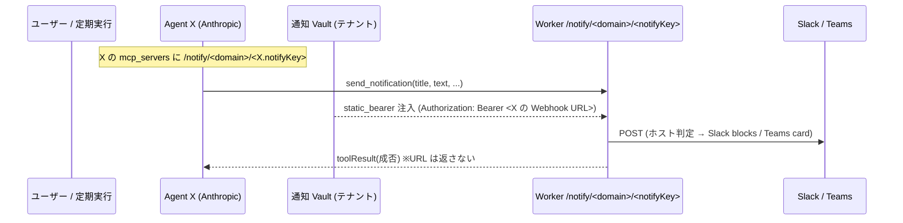

# 設計: 通知拡張 (Slack / Teams Webhook) — #13 【Agent 紐付け版】

requirements.md（設計A: エージェント発信）に基づく。**Webhook を Agent 単位で紐付ける**モデル。

## ✅ 前提検証済み（スパイク 2026-06-20）
**「Vault `static_bearer` の `token` が、MCP サーバ URL への接続時に `Authorization: Bearer <token>` で注入される」をライブ実証。**
- 手順: webhook.site を偽 MCP サーバ URL に見立て、`static_bearer{ token: "SPIKE-SENTINEL-…", mcp_server_url: <probe> }`
  を Vault に作成 → その URL を mcp_servers に持つ最小 agent + session(vault_ids=[vault]) + user message →
  webhook.site の受信ヘッダに **`authorization: Bearer SPIKE-SENTINEL-…`** を確認。
- 結論: 設計の根幹（Webhook URL を token に入れ、Agent ごとの notify URL に紐付け → Worker が Bearer で受領）は**成立**。
  Agent ごとに `mcp_server_url` を分ければ注入される token も Agent ごとに変わる（per-agent も成立）。
- 補足: 使い捨て agent/env/vault は archive 済み。本番では token に Webhook URL 実値を入れる。

## 確定事項
- **設計A（エージェント発信）+ Agent ごとに Webhook を紐付け**。
- 対象: **built-in + custom 両方** / **1 Agent = 1 Webhook**。
- Q1 保管 = **Vault `static_bearer` + 通知専用 MCP**（Worker はステートレス維持）。
- 登録権限 = **admin**（Agent 設定の一部として）。
- `platform` はツール引数で持たず、**Worker が Webhook URL のホストで Slack/Teams 自動判定**。

---

## 1. アーキテクチャ（Agent 紐付け）

各 Agent は安定した **`notifyKey`** を持ち、それを使って自分専用の通知 MCP URL `/notify/<domain>/<notifyKey>`
を `mcp_servers` に宣言する。通知 Vault にその URL へ紐付く `static_bearer`（= その Agent の Webhook URL）が
あれば、実行時に Anthropic が Bearer 注入する。**URL は Agent にもブラウザ JS にも渡らない**（AC-4）。

### 1.1 notifyKey（chicken-and-egg 回避）
- Anthropic の **Agent ID は作成時に未確定**。`mcp_servers` は作成 body に含めるため Agent ID は使えない。
- → 作成前に決まる **`notifyKey`** を使う:
  - **built-in**: `purpose`（`business` / `customizer-opus` / `customizer-sonnet`。安定）。
  - **custom**: 作成時に**クライアント生成 uuid** を `metadata.notifyKey` に保存。
- notify URL = `/notify/<domain>/<notifyKey>`。reconcile（#86, ID 保持）でも notifyKey は metadata に残り不変。

### 1.2 保管・注入（Q1 = Vault static_bearer）
- **通知 Vault**（テナント単位）: `resolveEnvironment` 流儀で `metadata{ purpose:notify, kintoneDomain }` を
  find-or-create（テナント1個）。中に **agent ごとの static_bearer** を持つ。
- **Webhook 登録**: admin が Agent 設定で URL を入力 → 通知 Vault に
  `static_bearer{ mcp_server_url: <worker>/notify/<domain>/<notifyKey>, bearer: <Webhook URL 実値> }` を upsert。
- **セッション/定期実行**: `vault_ids: [userVault, notifyVault]` を渡す（API は複数 vault 可）。
  - `/mcp/<domain>` の Bearer ← userVault（kintone OAuth, 既存）
  - `/notify/<domain>/<notifyKey>` の Bearer ← notifyVault（その Agent の Webhook URL）
- Worker は引き続き secret を保持しない。

### 1.3 ツール/サーバの常設 vs 条件付き
- **全 Agent に常設**: `mcp_servers` に notify URL、toolset に `send_notification` を**常に**含める。
  - 利点: webhook 設定/解除で **tool 構成が変わらない**（reconcile churn なし）。
  - 未設定 Agent: notify URL に credential 無し → Bearer 無し → ツールが「通知先未設定」を返す（無害）。
- これにより built-in は **一度だけ** toolsVersion 変化で reconcile、以降は webhook 設定変更で再 reconcile 不要。

---

## 2. `send_notification` MCP ツール（Worker）
- `packages/kintone-mcp/src/tools/send-notification.ts`（`createTool` + `toolResult`）。`/notify` toolset に登録。
- 入力（Zod, **platform なし**）: `{ title: string; text: string; fields?: {label,value}[]; link?: {label,url} }`。
- 動作: 注入 Bearer（= Webhook URL）を受け取り → ホストで platform 判定 → payload 整形 → `fetch` POST →
  2xx 成功 / 他失敗を `toolResult`。Bearer 無し（未設定）なら「通知先未設定です」を返す。
- セキュリティ: **URL/トークンをレスポンス・ログに絶対出さない**（`sanitizeError`、host のみ可）。AC-6。
- 権限: `always_allow`（非破壊）。

## 3. ペイロード整形（純関数・テスト可能）
- `notify/detectPlatform.ts`: ホスト判定（`hooks.slack.com`→slack / `*.webhook.office.com` `*.logic.azure.com` `outlook.office.com`→teams）。
- `notify/format.ts`: `buildSlackPayload`（blocks: header/section/fields/actions）/ `buildTeamsPayload`（最小 Adaptive Card）。

## 4. `/notify/<domain>/<notifyKey>` エンドポイント（Worker）
- `mcp.ts` 相当の薄い MCP ハンドラ。Authorization Bearer を抽出 → `send_notification` ツールへ渡す（kintone とは別 toolset）。
- ルーティング: `index.ts` + `kintone-domains.ts` の path pattern に `/notify/<domain>/<notifyKey>` を追加。

## 5. UI: Agent 設定に「通知先 Webhook URL」
> **Claude Design ハンドオフ採用**（[docs/design-handoff/webhook-notify/](../../docs/design-handoff/webhook-notify/)）。
> `NotifySection.tsx`（controlled: `value/onChange/onValidityChange/onTest?/hideHeader?`）+ `webhookPlatform.ts`
> （`detectPlatform`/`PLATFORM_META`/`maskedSecret`）を流用。状態1〜6 + built-in ポップオーバー + 一覧インジケータ込み。
> - UI view-model `WebhookConfig {platform, url?}` ↔ 実装: 保存=Vault static_bearer upsert + **platform を Agent metadata** に保存（表示用・非秘匿）。url は保存後返さない（= Vault のみ）。解除=credential archive + metadata クリア。
> - **D1 解決**: built-in は一覧行→`NotifySection hideHeader` の軽量ポップオーバー。
> - 要修正: `detectPlatform` の Teams 判定に **`*.logic.azure.com`（Teams Workflows Webhook）を追加**（client/Worker 共有）。
> - `--cw-*` arbitrary class → プロジェクトの意味クラスへ置換。Slack/Teams 識別色（緑/紫）は新規 literal or トークン化。
- **Custom Agent**: `AgentDetailModal`（編集）に Webhook URL フィールド（`PasswordInput` 流用、保存後マスク）を追加。
- **Built-in Agent**: 現状 AgentDetailModal は custom 編集が主。built-in にも設定経路が要る
  → AgentsListPane の built-in 行 or 専用の軽い設定 UI。**実装時に確定**（下記 D-open）。
- 保存: URL → 通知 Vault に static_bearer upsert（該当 Agent の notifyKey URL）。**登録状態はマスクのみ取得**（生 URL を JS に返さない）。
- 解除: credential archive。

## 6. エージェント連携 / 定期実行
- `buildMcpServers(workerUrl, domain, notifyKey)` に notify URL を追加（built-in は resolveBuiltInAgents、custom は agentDetailApi 作成経路の両方）。
- toolset に send_notification。#86 `toolsVersion` シグネチャに notify を反映（built-in は一度 reconcile）。
- 定期実行(#81): その Agent に webhook があれば、initial_events「…集計し、結果を通知して」で着信。
- system prompt に「通知を頼まれたら send_notification（未設定なら未設定と返る）」を1行。

## 7. テスト
- Worker: detectPlatform / format / send-notification（成功/4xx/未設定/URL マスク）。
- Plugin: Agent 設定の Webhook 保存（マスク表示・生 URL 非露出）/ resolveNotifyVault / static_bearer body /
  buildMcpServers に notify が入る / vault_ids 2本。

## 8. 影響範囲・リスク・スコープ感
- **規模は size:M を超えうる**（Worker 2本目 MCP・Vault/credential 拡張・全 Agent の mcp_servers/tool 追加・
  built-in/custom 双方の設定 UI・vault_ids 配線）。慎重に段階実装する。
- Vault/credential（セキュリティ中枢）と kintone 認証に副作用ゼロを担保。
- 非決定性（呼び忘れ・run 失敗時に飛ばない）は requirements 明記、決定的通知は #93。

## 9. 実装時に確定する未決点（D-open）
- **D1: built-in Agent の Webhook 設定 UI 経路**（AgentDetailModal を built-in でも開く / AgentsListPane 行に設定 / 別 UI）。
- D2: custom Agent の `notifyKey` 生成タイミング（作成時 metadata に uuid）。既存 custom Agent への後付けは「初回設定時に付与」。
- D3: 全 Agent に notify サーバ常設 vs webhook 設定済みのみ（本設計は**常設**＝churn 回避を採用）。
- D4: 接続テスト送信（任意）。
- D5: Teams は最小 Adaptive Card（Workflows/現行 Incoming Webhook 互換）を既定。
