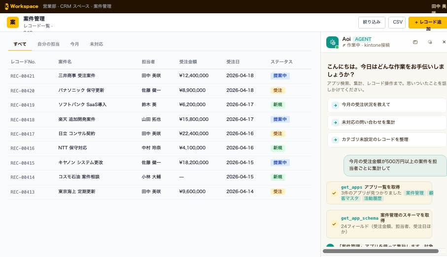
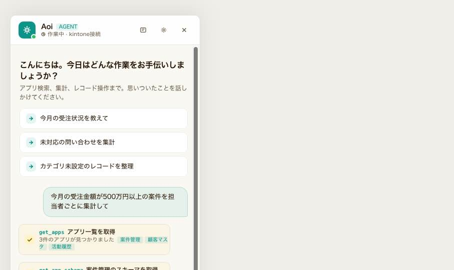
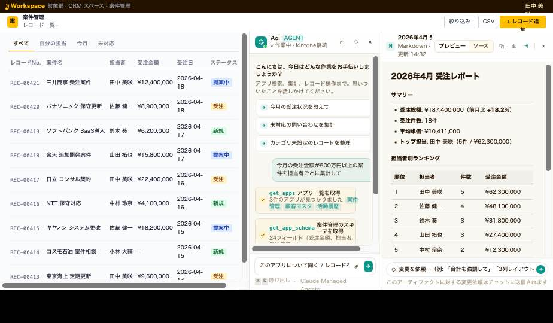
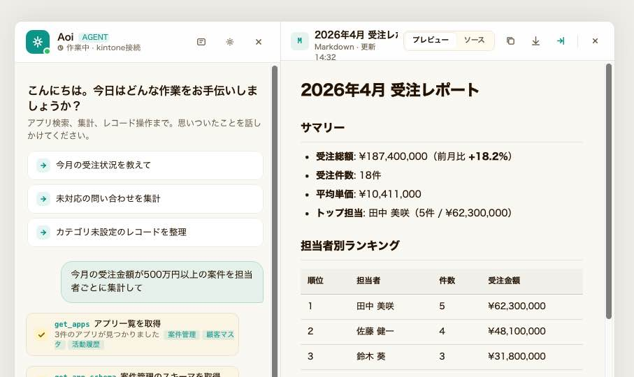
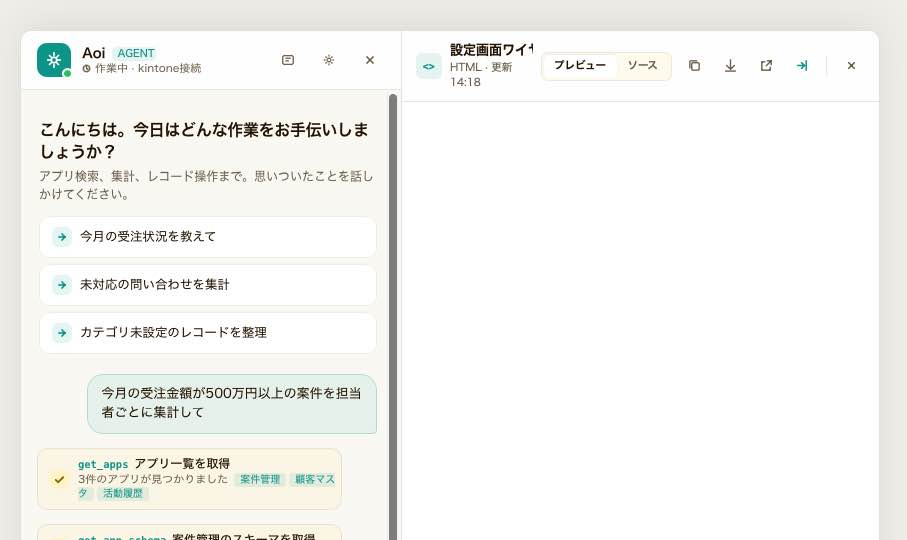
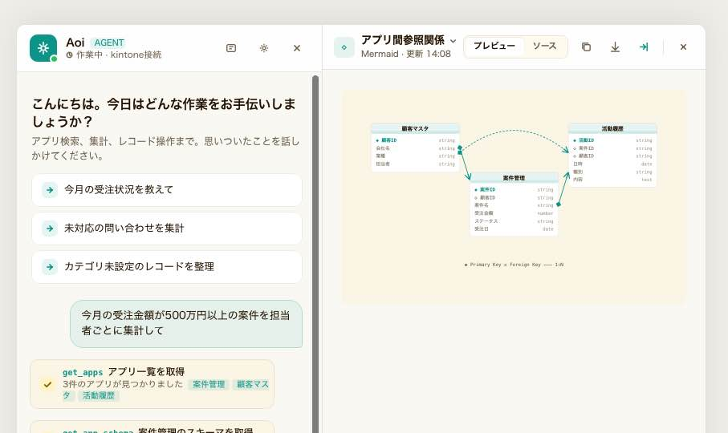
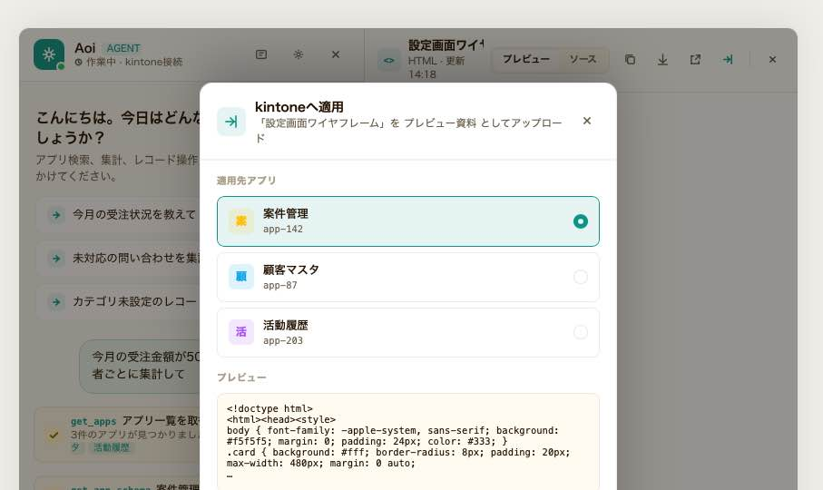

# Handoff: Cowork Agent for kintone — Chat Side Panel + Artifact Pane

## Overview

**Cowork Agent for kintone** は、kintone のレコード一覧画面のサイドパネルに常駐する
AI コワーカーエージェントのチャット UI。Claude Managed Agents API をバックエンドとし、
自然言語で kintone レコードの検索・集計・作成・更新・削除を実行する。

本ハンドオフは MVP (フェーズ1) の以下を含む：

- **チャット UI コンポーネント** (F-01 / F-07 HITL 承認 / F-08 非同期ジョブ進捗 / F-09 セッション継続)
- **Artifact ペイン** (Claude Desktop 風の再利用可能な成果物ビューア)
- シナリオ US-01 (自然言語での検索・集計)

---

## About the Design Files

同梱の `reference/` 配下の HTML/JSX は、**意図する見た目と挙動を示すためのデザインリファレンス
(プロトタイプ)** であり、そのまま本番コードとしてコピーするものではない。

タスクは「このデザインを **kintone プラグイン (JavaScript カスタマイズ) の実行環境で再現する** こと」。
kintone プラグイン側のビルド設定・使用ライブラリ・既存パターンに沿って実装し直す。
プロトタイプは React + Babel standalone で書かれているが、プラグイン側が素の JS/TS + 任意の
フレームワーク (React / Preact / lit / plain DOM など、バンドルサイズに応じて選択) で書かれるのが通常。

---

## Screenshots

各アートボードの静止プレビュー。インタラクションを確認するときは
`reference/Cowork Agent Chat Panel.html` を開いて design canvas からそれぞれを focus モードで
開いてほしい。

### Chat Panel — Rich variant

| | |
|---|---|
|  | **01 · kintone レコード一覧 + サイドパネル**<br/>サイドパネル 380px が常駐した状態。ホスト側 (kintone) のヘッダー・アプリバー・テーブルとの色 / 余白の取り合いを確認する用。 |
|  | **02 · チャット単体 (greeting → result)**<br/>greeting / user / thinking / tool call / progress / result カードを縦に並べた基本シナリオ US-01 の出力。 |
|  | **03 · HITL 承認 (destructive plan)**<br/>破壊的操作 plan card の見た目。warn 系の border + glow、「承認して実行」ボタンの強調を確認。 |

### Artifact Pane

| | |
|---|---|
|  | **04 · Side-by-Side レイアウト (Chat 380 + Artifact)**<br/>kintone ホストと並んだ最終形。Artifact ペインのヘッダー (kind icon / title▾ / tab toggle / actions) を含む。 |
|  | **05 · Markdown レンダラ**<br/>月次レポート。h1/h2/h3、表、blockquote、inline code の組版仕様。 |
|  | **06 · HTML サンドボックス**<br/>`sandbox="allow-scripts"` の iframe で受注ダッシュボードをプレビュー。 |
|  | **07 · Mermaid (ER 図)**<br/>SVG レンダラ。エンティティの ヘッダー / PK ◆ / FK ◇ / リレーション線の描画仕様。 |
|  | **09 · kintone 適用モーダル**<br/>破壊的操作。アプリ選択 + プレビュー + 警告バナー + 「適用する」ボタン。 |

> Bottom-sheet (狭幅) モードはスクリーンショット未収録。`reference/Cowork Agent Chat Panel.html`
> の "Artifact — narrow" アートボードを focus で開いて確認すること。

## Fidelity

**High-fidelity (hifi)**。色・タイポ・余白・アイコン・インタラクションはすべて最終形。
ピクセル忠実度を保って再現すること。下記の Design Tokens に挙げた値は厳密値である。

## Design Direction

- **フラットデザイン**。グラデーション・大きな影・グロー効果は使わない。
- アクセント色 (`accent`) はソリッドな単色で塗る。
- 影は `0 1px 3px rgba(0,0,0,0.04)` 程度の控えめなもののみ。
- 強調は色とウェイトで行う。装飾的な発光・ボカシは避ける。

---

## Target Variant

プロトタイプには当初 3 variant (minimal / rich / terminal) があったが、**Rich variant のみ** を
採用。本ドキュメントは Rich variant + Artifact Pane についてのみ記述する。

参照ファイル: `reference/variant-rich.jsx` / `reference/artifact.jsx` / `reference/data.jsx`

---

## Layout Modes

パネルは表示モードに応じて 3 形態をとる：

| モード | 条件 | レイアウト |
|---|---|---|
| **Chat Only** | Artifact 未生成 / 閉じている | 380px のチャット縦パネル |
| **Side-by-Side (拡張)** | Artifact 生成済み + デスクトップ幅 | 左 380px Chat / 右 残り Artifact (合計 880px+ 推奨) |
| **Bottom Sheet** | 狭い画面 (Artifact 生成済み) | チャット全画面 + 下から 80% スライドアップで Artifact |

---

## 1. Chat Panel (380px 固定幅)

### 1a. Header (高さ約60px)

| 要素 | 詳細 |
|---|---|
| Avatar | 34×34, `border-radius: 10px`, 背景は **アクセント色のソリッド** (フラット), 中央 18×18 星型アイコン (stroke 1.8), アイコン色は背景明度で `#fff` か `#231200` |
| Status dot | Avatar 右下 11×11 緑 (`#22c55e`), パネル背景色で 2px ボーダー |
| Agent name | "Aoi" (13.5px / w600 / `c.text`) |
| AGENT badge | name の右, 10px / w500, アクセント文字, `accent+1a` 背景, 4px radius |
| Status line | 11px / `muted`, 9×9 時計アイコン + "作業中 · kintone接続" |
| Icon buttons | 30×30 透過, ホバー時 `cardHi`, タスク / 設定 / 閉じる の 3 つ |
| Border bottom | 1px / `c.border` |
| Background | `c.panel` + `backdrop-filter: blur(12px)` |

### 1b. Chat Scroll (flex: 1, overflow-y auto)

- padding: density に応じて 14/18/22 px (compact/comfortable/airy)
- gap: 同上 (10/14/18 px)
- 各メッセージは `slideUp 0.28s ease-out` でフェードイン

### 1c. Composer (固定下)

- padding `10px 14px 14px`, border-top 1px, `c.panel` + blur
- 入力欄: 1px border, radius 14, padding `8 8 8 14`, `c.card` 背景, `c.accentSoft` の inset shadow
- 添付ボタン (30×30 透過) + 送信ボタン (32×32, **アクセントソリッド**, radius 10)
- 下部ヒント: 10px / `subtle`, `⌘K 呼び出し · Claude Managed Agents`

---

## 2. Message Types

すべて `RichMessage` で kind 分岐。

### 2a. greeting
- 16px w600 hello + 12px muted サブ
- Suggestion ボタン3つ縦並び: padding `10 12`, `c.card`, 1px border, radius 10, 左に 20×20 矢印アイコン (`accentSoft` 背景)

### 2b. user
- align right, max 85%, padding `10 14`
- 背景 `c.user` (= `accent+14`), 1px border `accent+40`
- radius `16 16 4 16`

### 2c. agent / thinking
- 22×22 アバター (アクセントソリッド円) + 本文
- thinking は 5×5 ドットが 0.15s ずつ blink

### 2d. tool call
- 1px border `cardBorder`, radius 10, padding `8 11`
- 左 20×20 チェックマーク (`okSoft` 背景, `c.ok` 色)
- 右に tool name (mono 10.5 / accent / w600) + label (12 / w500) + detail (11 / muted)
- items は `accentSoft` 背景の chip (10px, padding `1 6`, radius 4)

### 2e. plan card
- 1px border, radius 14, `c.card`
- destructive=true: border `c.warn+55`, `box-shadow: 0 0 0 4px warn15, 0 4px 20px warn20`
- ヘッダー: padding `10 14`, 背景 `accentSoft` or `warnSoft`, 12.5px w600 タイトル + 10px 要承認バッジ
- ステップ: 22×22 番号バッジ + OP ラベル (9.5 mono 700 muted upper) + テキスト
- 推定時間: 1px dashed border 上, 11px muted + 時計アイコン
- destructive ボタン: 「承認して実行」(warn 背景 / 白文字) + 「修正」「キャンセル」(透過)

### 2f. progress card
- 22×22 スピナー + タイトル + サブ + 大きい % (16 w700 accent)
- プログレスバー: 高さ 6, radius 3, `accentSoft` 背景, **アクセントソリッド** 内側バー + シマーアニメ
- substeps: 13×13 円 (済: `c.ok` 塗り + 白チェック / 未: 1.5px border)

### 2g. result card
- 1px border, radius 14, `box-shadow: 0 4px 20px rgba(0,0,0,0.04)`
- ヘッダー: padding `12 14`, **`accentSoft` ソリッド背景** (フラット), 1px border 下
- 各 row: 20×20 イニシャル円 + 名前 + 件数 + 金額 (tabular-nums)
- 横棒グラフ: 高さ 3, **アクセントソリッド** バー
- followup chips: radius 999, `c.card` 背景, 1px border, 11px

### 2h. artifact card (新規)
- 1px border `cardBorder` (open 中は `accent+66`), radius 12
- 36×36 kind アイコン (mono 12 / kind 別色 + `+1a` 背景)
- 9px upper "📄 ARTIFACT · {KIND}" ラベル
- 13px w600 title + 11px muted summary
- 右に「開く →」ピル (`cardHi` 背景) または「表示中」(accent+18 背景)

---

## 3. Artifact Pane

### 3a. Header (高さ 50px)

| 要素 | 詳細 |
|---|---|
| Kind icon | 26×26, radius 6, `accentSoft` 背景, accent 色, mono 10 w700 |
| Title button | クリックでドロップダウン: 13 w600 title + ▾ + サブ "{kind label} · 更新 14:32" |
| Tab toggle | 「プレビュー / ソース」セグメント, padding `4 10`, 10.5 w600, アクティブは `c.card` 背景 + 微影 |
| Action icons | 28×28, ホバー時 `cardHi`: コピー / DL / (HTML時) 新タブ / **kintone適用** (accent ホバー色) / 区切り / 閉じる |
| Border bottom | 1px `c.border` |
| Background | `c.panel` + blur |

#### History dropdown (タイトル▾)
- 絶対配置 (top: 100%, left: 0), margin-top 6
- min-width 280, 1px border, radius 10, `box-shadow: 0 8px 24px rgba(0,0,0,0.12)`
- ヘッダー: 10px upper "このセッションのアーティファクト · {n}"
- 各 item: padding `10 12`, 22×22 kind アイコン + title (12.5 / w500) + summary (10.5 muted)
- 現在選択は `cardHi` 背景, 末尾に時刻

### 3b. Body (flex: 1, overflow-y auto)

#### Markdown
- padding `24 28`, 13.5px / line-height 1.7
- h1: 22 w700, h2: 16 w700 + 1px border-bottom, h3: 13.5 w600
- table: 12.5px, header `rgba(0,0,0,0.03)` 背景 + 1.5px border-bottom
- blockquote: left 3px border, padding `10 14`, `rgba(0,0,0,0.025)` 背景
- inline code: mono 11.5, `rgba(0,0,0,0.06)` 背景, padding `1 5`

#### HTML
- iframe `sandbox="allow-scripts"`, 100% / 100%, border none, `#fff` 背景
- 親の overflow auto, `#fafafa` 背景でiframe を浮かす

#### Mermaid
- padding 24, viewBox 620×360, max-width 620
- 各エンティティ: 180px幅, 1px border, radius 6, ヘッダー `accentSoft`
- フィールドは mono 9.5; PK は ◆ + accent / FK は ◇
- リレーション: アクセント色 1.4px 線 + ◆ (start) と crowsfoot (end) marker

### 3c. Footer (フッターコメント欄)

- padding `10 14`, border-top 1px, `c.panel`
- ピル形 input (radius 999, padding `6 6 6 14`, `c.card` 背景, 1px border)
- 左: 13×13 吹き出しアイコン (muted), 中央: placeholder "変更を依頼…（例: 「合計を強調して」）"
- 右: 26×26 円形送信ボタン (アクセントソリッド)
- 下に 10px subtle: "このアーティファクトに対する変更依頼はチャットに送信されます"
- **編集 UI は持たない**。入力はそのままチャットに新規ターンとして流れる

---

## 4. kintone 適用モーダル

破壊的操作扱い。Apply ボタン押下時に表示。

- 背景オーバーレイ: `rgba(20, 14, 5, 0.45)`
- モーダル本体: max-width 460, `c.card`, radius 14, 1px border, `box-shadow: 0 20px 60px rgba(0,0,0,0.25)`
- ヘッダー: 32×32 アクセントアイコン + 14 w600 タイトル "kintoneへ適用" + 11.5 muted "「{title}」を {target} としてアップロード" + 閉じるボタン
- ボディ:
  - "適用先アプリ" (10.5 upper subtle)
  - アプリリスト: 各 padding `10 12`, radius 8, 28×28 アプリアイコン (アプリ色 +22 背景), 名前 + ID (mono), 右に 16×16 ラジオ (選択時 5px solid accent border)
  - "プレビュー" + content の先頭 240 文字 (mono 10.5, max-height 110, scroll)
  - 警告バナー: `#fef9e7` 背景, `#fcd34d55` border, ⚠️ アイコン + "既存のカスタマイズ設定が上書きされます"
- フッター: padding `12 18`, `c.cardHi` 背景, 「キャンセル」(透過 + border) + 右寄せ「適用する」(アクセントソリッド + 微影)

---

## 5. State Management

### 5a. Chat
- `messages: Message[]` — kind ベースのユニオン (greeting, user, thinking, agent, tool, plan, progress, result, artifact-card)
- `approved: boolean` — destructive plan 承認状態
- スクリプト再生中は setTimeout で逐次 push, thinking → 次メッセージで差し替え

### 5b. Artifact
- `artifacts: Map<id, Artifact>` — セッション全 Artifact
- `currentId: string | null` — 表示中
- `tab: 'preview' | 'source'`
- `menuOpen: boolean` — 履歴ドロップダウン
- `applyModalOpen: boolean`

### 5c. Artifact 型
```ts
type Artifact = {
  id: string;
  kind: 'markdown' | 'html' | 'mermaid' | 'code' | 'svg' | 'kintone-customize-js' | 'csv' | 'json';
  title: string;
  summary: string;
  language?: string; // code 時の言語
  content: string;
  updatedAt: string;
};
```

### 5d. Custom Tool 連携
Anthropic Managed Agents の **Custom Tool `create_artifact`** を Plugin 側で実装：
1. Agent が `create_artifact({id, kind, title, summary, content})` を呼ぶ
2. `agent.custom_tool_use` イベントで `artifacts` Map に保存 (同じ id なら更新)
3. `user.custom_tool_result` で `{ok: true}` 即返却
4. チャットに artifact-card を push
5. 初回生成時は自動で右ペインを開く

---

## 6. Animations

- `slideUp 0.28s ease-out`: メッセージ入場
- `blink 1.2s infinite`: thinking ドット (3個, 0.15s 遅延)
- `shimmer 1.6s infinite linear`: progress バーの内側
- `spin 0.9s linear infinite`: progress スピナー
- アバター下の status pulse は `pulse-ring 1.8s` (リング拡大消失)
- ドロップダウン / モーダル: スナップ表示 (アニメ無し)。必要なら 0.15s fade のみ

---

## 7. Design Tokens

### Colors (Light Theme)
```
bg:          #faf8f3
panel:       rgba(255,255,255,0.85)
border:      rgba(35,18,0,0.10)
text:        #231200
muted:       #6b5f4a
subtle:      #a89d85
card:        #ffffff
cardBorder:  rgba(35,18,0,0.08)
cardHi:      rgba(255,191,0,0.06)
accent:      #0d9488 (デフォルト, Tweaks で変更可)
accentSoft:  accent + 1a (10% alpha)
user:        accent + 14
userBorder:  accent + 40
warn:        #b45309
warnSoft:    #fef3c7
ok:          #8a6400
okSoft:      #fff4c9
```

### Colors (Dark Theme)
```
bg:          #1a160f
panel:       rgba(34,28,19,0.75)
text:        #ede4d0
muted:       #a89d85
card:        rgba(42,34,23,0.85)
warn:        #f59e0b
ok:          #ffbf00
```

### Typography
```
Sans:  'Noto Sans JP', 'Hiragino Sans', 'Yu Gothic', sans-serif
Mono:  'JetBrains Mono', 'SF Mono', Menlo, monospace
```
- Body: 13px / 1.5
- Tabular numerals (`font-variant-numeric: tabular-nums`) は金額・件数・% に必須

### Spacing
- density compact: 10
- density comfortable: 14 (default)
- density airy: 18

### Radius
- 円: 50%
- 標準: 6, 8, 10, 12, 14
- ピル: 999

### Shadow
- Card: `0 1px 3px rgba(0,0,0,0.04)`
- Card (強調): `0 4px 20px rgba(0,0,0,0.04)`
- Modal: `0 20px 60px rgba(0,0,0,0.25)`
- Dropdown: `0 8px 24px rgba(0,0,0,0.12)`
- Plan (destructive): `0 0 0 4px warn15, 0 4px 20px warn20`

---

## 8. Tweakables (任意)

実装側で表示密度・テーマ・アクセント色を切り替え可能にしておく：

```js
const TWEAKS = {
  accent_rich: '#0d9488',  // teal default — 他: #059669, #d97706, #ffbf00, #231200
  theme: 'light',          // light | dark
  density: 'comfortable',  // compact | comfortable | airy
};
```

---

## 9. Files (reference)

- `reference/Cowork Agent Chat Panel.html` — 全アートボードを並べた design canvas (エントリポイント)
- `reference/variant-rich.jsx` — Rich variant のチャット本体 + メッセージ kind 別レンダラ
- `reference/artifact.jsx` — Artifact ペイン + Markdown/HTML/Mermaid レンダラ + 適用モーダル + チャットカード
- `reference/data.jsx` — シナリオデータ (`SCENARIO`) + Artifact サンプル (`ARTIFACTS`)
- `reference/styles.css` — 共有トークン + アニメーション + Markdown スタイル
- `reference/design-canvas.jsx` — プレビュー用 canvas (実装時は不要)

---

## 10. 実装順序の推奨

1. **Step 1 (S/M)** — Foundation: チャット骨格 + greeting/user/agent + composer
2. **Step 2 (M)** — メッセージ kind 拡張: tool / plan / progress / result + アニメーション
3. **Step 3 (M)** — Artifact 基盤: Custom Tool ハンドラ + Artifact Map + チャットカード + ペイン chrome
4. **Step 4 (M)** — レンダラ: markdown → html (sandbox iframe) → mermaid (動的 import 推奨)
5. **Step 5 (S)** — kintone 適用モーダル (破壊的操作扱い、アプリ選択 + 警告 + 適用)
6. **Step 6 (S)** — Bottom-sheet モード (狭幅対応) + 履歴ドロップダウン

---

## 11. 注意点

1. **Custom Tool は client-side 実行** — Anthropic 側の computer-use とは別。`user.custom_tool_result` で「保存しました」と即返す軽量実装で OK
2. **HTML iframe は `sandbox="allow-scripts"` 必須** — kintone 環境のスタイル干渉防止 + 同一オリジン外し
3. **Bundle size** — mermaid (~600KB) と shiki (~150KB) は **動的 import** で初期ロードを汚さない
4. **ID 衝突** — Agent が同じ id で再呼出 → 更新扱い。新規にしたいときは別 id にする運用ルールをシステムプロンプトに明記
5. **Session 復元** — ページリロード時は events stream から `agent.custom_tool_use` を replay して artifact を再構築。`user.custom_tool_result` の再送信は不要
6. **編集 UI は実装しない** — Artifact フッターのコメント欄はチャットに新ターンとして流すのみ。差分表示や textarea 編集は MVP スコープ外
7. **フラットデザイン徹底** — グラデーション・大きな影は使わない。アクセントはソリッド単色
